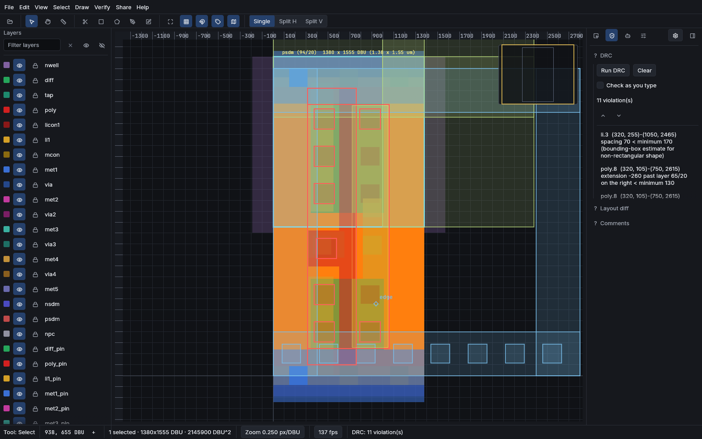
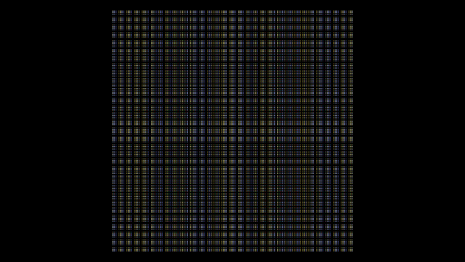
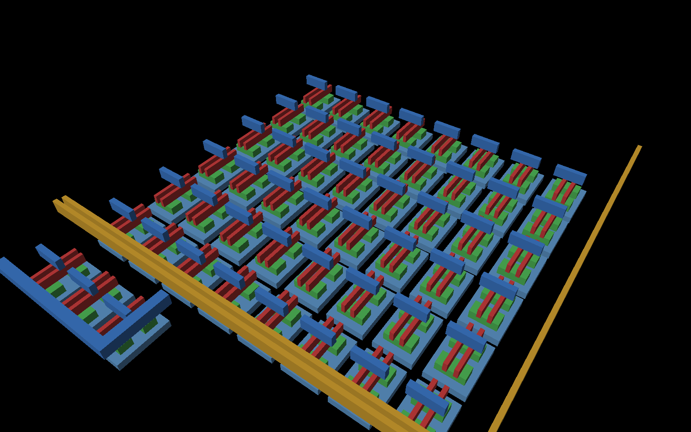
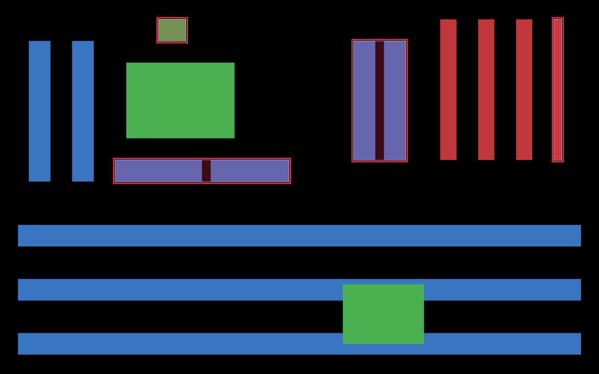
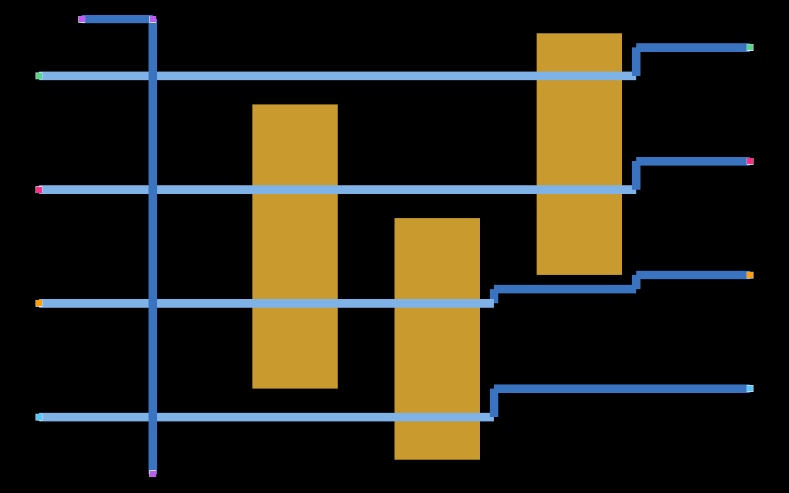
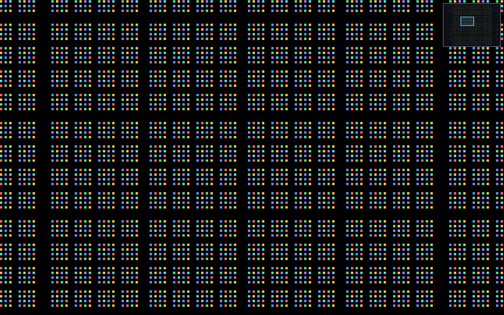
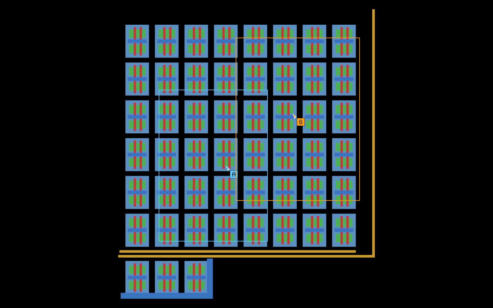
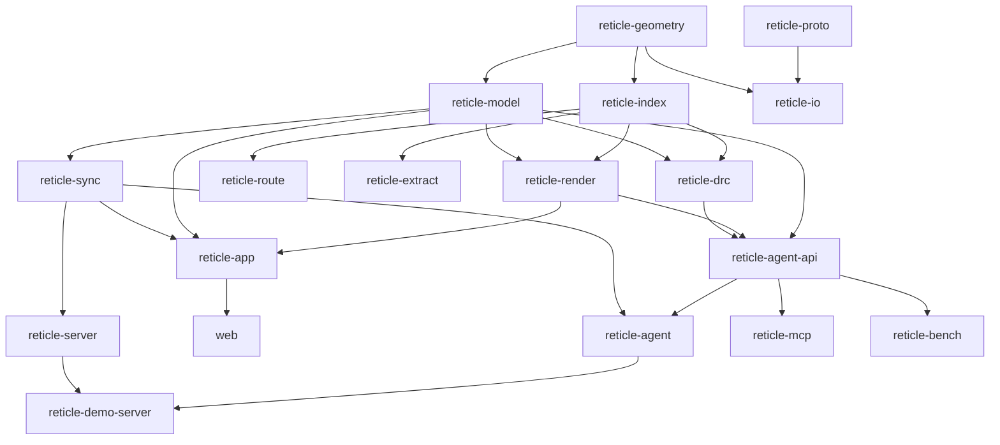

<p align="center">
  
</p>

# Reticle

[](#license)
[](https://alpharomerojl.github.io/reticle/)

**[Try the live demo](https://alpharomerojl.github.io/reticle/)**, it runs entirely in
your browser via WebGPU and WebAssembly. Use a current version of Chrome or Edge for the
WebGPU path; the app falls back to WebGL2 where WebGPU is unavailable. The public page
opens into the agent replay theater (a recorded propose-verify-correct run played back
through a live session), with the full editor one click away.

Reticle is a browser-native, GPU-accelerated editor for very large hierarchical 2D
layout scenes, written in Rust and compiled to both native and WebAssembly. It renders
and edits integrated-circuit geometry (rectangles, polygons, and paths on named layers),
organized into cells, instances, and arrays, so a small cell placed thousands of times
yields effectively billions of leaf shapes that still browse at interactive frame rates.

On top of the geometry sit CAD-style pan, zoom, select, measure, and annotate tools, a
full drawing and vertex-editing suite, boolean and transform operations, a design-rule
checker, a router, connectivity extraction, GDSII and OASIS import and export, embedded
scripting, and real-time multi-user collaboration.

The same engine is drivable by an AI agent. A serializable command API exposes every
edit, and a propose-verify-correct harness lets a model build layouts under the real
design-rule and connectivity checks, so correctness is decided by objective checkers
rather than by the model's word. An MCP server offers that surface to any model host, a
graded benchmark scores it against both a frontier-style client and local Ollama models,
and a rate-limited demo server runs it live and streams each step to a room you can watch.

For where Reticle sits among layout tools, and the full list of what it deliberately does
not do (no synthesis, no timing, no device-level LVS, no tape-out signoff), see
[Positioning](docs/src/positioning.md).

## A quick tour

The agent proposes edits, the design-rule checker flags a violation (red), and the loop
corrects it until the check passes. This is the real render path replaying the transcript,
the same one the in-app replay theater plays.

<p align="center">
  
</p>

Panning and zooming across a layout of millions of shapes, at interactive frame rates:

<p align="center">
  
</p>

### Engine gallery

Each image is rendered by the real engine and regenerated by `just capture-media`.

| 3D layer stack | Design-rule check | Routing |
|---|---|---|
|  |  |  |

| Minimap overview | Live collaboration |
|---|---|
|  |  |

> Status: this is the v6.0.0 development line (the tagged release lands after the final
> QA gauntlet). On top of the v5.0.0 agent layer, v6.0.0 fixes the public GitHub Pages
> deploy (the browser bundle now loads under the project subpath and opens into a playing
> replay theater instead of hanging), adds a local-model benchmark backend (Ollama,
> OpenAI-compatible), a deep expansion of the editor (drawing and vertex editing, boolean
> and transform operations, productivity tools, snapping and guides, layer and technology
> editing, search and selection depth, and view and export), an expanded agent surface
> (five higher-level editing commands, region-scoped context packs, mid-session
> refinement, and planning transparency), and three new credibility chapters. Everything
> described here is merged and green under the local gate (`just ci`, plus `just e2e` and
> `just e2e-subpath`). For a skeptical, audited account of exactly what is fully
> implemented, what is partial, and how to verify each claim yourself, see
> [docs/STATUS.md](docs/STATUS.md).

## Why it is interesting

It works the exact problem a semiconductor tooling team solves: visualizing and editing
massive layout geometry at interactive speed. That pulls together performance
engineering, computational geometry, GPU rendering, spatial indexing, schema evolution,
and distributed collaboration in one codebase, with a checker-graded agent layer on top.

The north-star demo: open a dense chip-like layout of over one million polygons in a
browser, pan and zoom at 60 fps, measure a spacing, run an incremental design-rule check
and jump to a violation, drop an annotation, and watch a second user's cursor and edits
appear live.

## Features

- **Exact-integer geometry.** Database-unit geometry with robust polygon booleans,
  offsetting, and convex decomposition, validated against a brute-force winding-number
  oracle.
- **Hierarchy for scale.** Cells, instances, and arrays with nested transforms,
  flattening, per-cell bounding boxes (memoized, cleared on every edit), and cell-level
  culling, so an arrayed cell with billions of effective leaf shapes costs only what is
  on screen.
- **GPU rendering on `wgpu`, on screen and offscreen.** The interactive canvas draws
  through an `egui-wgpu` paint callback on eframe's device, with a retained scene that
  caches per-cell tessellation once, expands instances into a per-instance transform
  buffer, and stores geometry in fixed-size GPU pages so a camera move rewrites a single
  uniform rather than a buffer. A GPU-driven draw list culls cell bounding boxes in a
  compute shader, compacts the survivors with a workgroup scan, and issues an indirect
  draw; 4x MSAA and zoom-driven level-of-detail are in the pipeline. On top sit canvas
  text labels, a minimap, split viewports, rebindable keybindings, live DRC and net
  overlays, and a 3D layer-stack view with a cut-line cross-section.
- **A full editing application (`egui`), native and in the browser.** A command palette,
  layer manager, and technology editor; drawing and vertex-editing tools; boolean and
  transform operations (union, intersection, difference, xor, offset, rotate, mirror,
  align, distribute); productivity tools (an in-app clipboard, an array tool with live
  preview, numeric move-by-delta, and a via-stack builder); snapping to grid, geometry,
  and pulled-out guides; a filter-query search bar with saved selection sets and a
  cell/instance outline; theme switching, view bookmarks, and PNG/SVG export; a
  measurement suite, session save/restore, an undo-history panel, a live DRC panel with
  net highlighting, and a properties inspector.
- **Spatial indexing.** A bulk-loaded R-tree, a uniform grid, and a tile/LOD pyramid,
  with point, rectangle, nearest-edge, and k-nearest queries, each checked against a
  linear oracle.
- **Design-rule checking.** A declarative engine (width, spacing, enclosure, extension,
  notch, area, density, angle) with incremental re-check, checked against a naive
  reference oracle, plus a cited SKY130 rule subset (see
  [SKY130 grounding](docs/src/sky130.md)).
- **Routing.** A grid and maze router with rip-up and reroute, obstacle avoidance, and
  cross-layer vias, checked against a Manhattan-optimality oracle.
- **Connectivity extraction.** Net connectivity across contacts and vias, with net
  highlighting and a compare against an expected netlist (opens and shorts), checked
  against an independent union-find oracle. This is net-level connectivity, not
  device-level LVS.
- **IO.** GDSII read and write (full hierarchy) plus an in-house OASIS subset that
  round-trips rectangles, polygons, paths, instances, and arrays, plus GDS TEXT
  labels and a technology-file format.
- **Collaboration.** A hierarchical CRDT (`yrs`) with presence, threaded comments, and
  offline reconcile over a WebSocket relay, with order-independent convergence tests.
- **Agent and automation.** A serializable command API over the engine
  (`reticle-agent-api`, 30 commands with stable element ids and replayable transcripts,
  including five higher-level editing commands: boolean-combine, align, distribute,
  offset, and build-via-stack), a propose-verify-correct harness that grades a model
  against the SKY130 DRC subset and connectivity intent with region-scoped context packs,
  mid-session refinement, and per-iteration planning transparency (`reticle-agent`), an
  MCP server exposing every command plus three context tools (`reticle-mcp`), a graded
  benchmark (`reticle-bench`, suite v0.4.0, 75 tasks across five tiers) runnable against a
  frontier-style client or a local Ollama model, and a rate-limited demo server that runs
  the loop live and streams each step to a watchable room (`reticle-demo-server`). See the
  [agent](docs/src/agent.md), [MCP](docs/src/mcp.md), and
  [benchmark methodology](docs/src/benchmark.md) chapters.
- **Embedded scripting (`rhai`)** exposing the model, with a plugin folder and example
  scripts.

## Agent benchmark

The benchmark drives a model through the same propose-verify-correct loop and scores each
task with an objective, two-way-tested checker (it must both accept the intended solution
and reject a perturbed one), so a score is a real pass rate, not a vibe. Every result is
labeled with the backend, model, and quantization that produced it, so a machinery
baseline, a local model, and a frontier model are never conflated. The suite is
`benchmarks/layout-tasks/manifest.toml`, version 0.4.0, 75 tasks across five tiers. See
[Benchmark methodology](docs/src/benchmark.md) for the full account.

The results below are the committed local-model runs, measured on the host in
[PERF.md](PERF.md) against a local Ollama endpoint. They were measured over the 63-task
set (before the 12 Wave-3 tasks were promoted to v0.4.0); they are shown here labeled as
a 63-task run. A 75-task v0.4.0 re-run of both models is pending.

**Two-model comparison, 63-task run (local Ollama, labeled by model and quantization):**

| Model | Quantization | Tier 1 | Tier 2 | Tier 3 | Tier 4 | Tier 5 | Overall |
|---|---|---:|---:|---:|---:|---:|---:|
| `gpt-oss:16k` | MXFP4 | 9/9 | 10/11 | 15/25 | 2/8 | 6/10 | **42/63 (67%)** |
| `qwen2.5-coder:16k` | Q4_K_M | 4/9 | 11/11 | 7/25 | 1/8 | 5/10 | **28/63 (44%)** |

The gap has a concrete cause: `gpt-oss:16k` returns native tool calls, while
`qwen2.5-coder:16k` ignores the forced tool choice and embeds the call in message text,
which a text fallback recovers less reliably. Both paths are handled and regression-tested.
These are small local models at 16k quantized weights; the numbers are a realistic floor,
not an upper bound.

<!-- BENCHMARK TABLE PLACEHOLDER (orchestrator fills at integration): replace or augment
     the 63-task table above with the consolidated two-model table over the full 75-task
     v0.4.0 suite (gpt-oss:16k MXFP4 and qwen2.5-coder:16k Q4_K_M), keeping the per-tier
     and overall columns and the backend/quantization labels. Do not fabricate numbers. -->

The deterministic `MockModel` (no key, no network) is scripted to solve only three sample
tasks; running it exercises the whole pipeline for all 75 tasks but is a **machinery
baseline, not a model score**, and is labeled as such.

## Performance

Measured on an RTX 4060 Ti; see [PERF.md](PERF.md) for the methodology and the full table.

| Operation | Measured |
|---|---:|
| Retained render, 10,000,000 leaf shapes | 113 fps (was 6.1) |
| Retained render, 1,000,000 leaf shapes | 295 fps |
| WASM cold load to first interactive frame (WebGPU, loopback) | ~640 ms |
| Collaboration echo through the localhost relay (median) | 788 µs |
| Bulk-load an R-tree over 1,000,000 shapes | 232 ms |
| Nearest-shape query over 1,000,000 shapes | 888 ns |
| Polygon union of 1,024 overlapping squares | 1.49 ms |
| Import a 4,194,304-leaf hierarchical layout (headless CLI) | 37 ms, 7.5 MB peak |
| Render 4,194,304 leaf shapes offscreen to 2560x1440 (headless CLI) | 809 ms, 594 MB peak |

The retained renderer caches per-cell tessellation once and uploads geometry to
fixed-size GPU pages, so each frame is only a draw, not a rebuild; that is what lifts the
10,000,000-shape scene from 6.1 to about 113 fps. Hierarchy is never flattened for
browsing, so cell culling and a compute-shader cull-plus-compaction stage keep the
on-screen cost proportional to what is visible rather than to the size of the design.

## Architecture

Reticle is a Cargo workspace. The core geometry, indexing, and model crates are free of
GPU, async, and UI code so they stay fast to test and clean to read.



See `docs/PLAN.md` for the crate responsibilities and `docs/decisions/` for the
architecture decision records. The full book is under `docs/`. New to the editor?
The app opens on a Start screen with four [worked use cases](docs/src/use-cases.md):
inspect a SKY130 cell, find and fix a violation, watch the agent work, and build
with the new tools.

## Quickstart

Prerequisites: a recent Rust toolchain (see `rust-toolchain.toml`) and
[`just`](https://github.com/casey/just). A WebGPU-capable browser (current Chrome or Edge)
is needed for the web demo. The local-model benchmark additionally needs a running
[Ollama](https://ollama.com) endpoint.

```sh
# Build everything and run the full local gate (style, format, clippy, tests, docs, wasm,
# licenses, spelling). There is no CI service; this recipe is the gate.
just ci

# Native application.
cargo run -p reticle-app --release

# Web demo (WebGPU with a WebGL2 fallback), served locally.
just web-serve

# Build the browser bundle for the project subpath and smoke-test the live Pages URL.
just deploy-pages        # builds crates/web/dist with --public-url /reticle/
just smoke-pages         # asserts the live base URL and assets return 200 under /reticle/

# Collaboration relay.
cargo run -p reticle-server --release

# Headless pipeline: import, DRC, route, extract, export, render-to-image.
cargo run -p reticle-cli --release -- --help

# Generate a deterministic chip-like layout to browse or benchmark.
just gen-layout 1000000 8 3 scratch/gen.gds

# Rate-limited demo server: the propose-verify-correct loop behind submit/status/cancel,
# streaming each step to a watchable room. Offline scripted agent with no key; set
# ANTHROPIC_API_KEY for the live model.
just demo-up

# Score the agent across the 75-task graded benchmark (deterministic mock by default).
just bench-agent

# Score it against a LOCAL model via Ollama (configure the model first).
# $env:RETICLE_MODEL_NAME = 'gpt-oss:16k'
just bench-agent-ollama

# End-to-end browser tests: a WebGL2 gate, a WebGPU-flagged run, and a Pages-subpath run.
just e2e
just e2e-subpath
```

## How it works

- **Spatial index and hierarchy culling.** Geometry is indexed in a bulk-loaded R-tree
  and a tile/LOD pyramid. Hierarchy is never flattened for browsing; instead each cell's
  bounding box is computed and rendering culls whole instances and arrays that fall
  outside the view, so an arrayed cell with billions of effective leaf shapes costs only
  what is on screen.
- **GPU-driven draw list.** A compute shader flags which cell bounding boxes overlap the
  viewport, a workgroup-scan compaction pass reserves the survivors and fills an
  indirect-draw argument buffer, and one indirect draw paints them, so the draw count
  comes from the GPU and only a small count returns to the CPU. Instanced draws paint each
  layer with its own style, and a tile/level-of-detail pyramid provides coarser
  representations for zoomed-out browsing.
- **DRC and routing.** The design-rule checker evaluates declarative rules against the
  indexed geometry and re-checks incrementally on edit. The router builds a routing grid,
  runs a maze search per net, and rips up and reroutes to resolve congestion.
- **CRDT sync.** The document is mirrored onto a `yrs` CRDT so concurrent edits converge
  regardless of order. A thin relay broadcasts updates and awareness; edits made offline
  reconcile on reconnect.
- **Agent and verification.** A serializable command API exposes every edit, and a
  propose-verify-correct harness drives a model against the SKY130 DRC subset and
  connectivity intent, feeding violations back until an objective checker passes, so
  correctness is graded rather than asserted. For a local repair the harness can hand the
  model a region-scoped context pack (a minimal, region-local slice of the document)
  instead of the whole layout, and a user can fold a new constraint into the running loop
  between iterations without restarting it. Every run writes a replayable transcript with
  a document hash, so a result is deterministic to replay and auditable; the agent's edits
  also mirror onto the CRDT as atomic steps, so a human can watch and edit alongside it.

## Positioning

Reticle is a fast, browser-native layout viewer and editor with a verified checker core
(the DRC, router, and extractor are each pinned to an independent reference oracle) and a
checker-graded agent layer. It overlaps a narrow slice of the layout-tool field: KLayout
and Magic for viewing and editing, the SKY130 PDK as a source of cited data. It is a
portfolio-grade engineering project and a research vehicle for machine-driven layout, not
a production EDA tool.

It deliberately does **not** do logic or physical synthesis, timing (no STA, no parasitic
extraction, no timing-driven optimization), device-level LVS (extraction is geometric net
connectivity, not device recognition against a schematic), or tape-out signoff (the SKY130
DRC subset is a fast first filter, explicitly not tape-out clean). The full account, with
what the established tools do that Reticle does not, is in
[Positioning](docs/src/positioning.md).

## Tech stack

Rust, `wgpu` (WebGPU / Vulkan / Metal / DX12 with a WebGL2 fallback), `egui` and `eframe`
(with an `egui-wgpu` paint callback for the canvas), `i_overlay`, `rstar`, `gds21`,
`lyon`, `yrs`, `axum`, `prost`, `rhai`, `pathfinding`, `criterion`, `proptest`, and
`cargo-fuzz`.

## License

Dual-licensed under either of

- Apache License, Version 2.0 ([LICENSE-APACHE](LICENSE-APACHE))
- MIT license ([LICENSE-MIT](LICENSE-MIT))

at your option.
