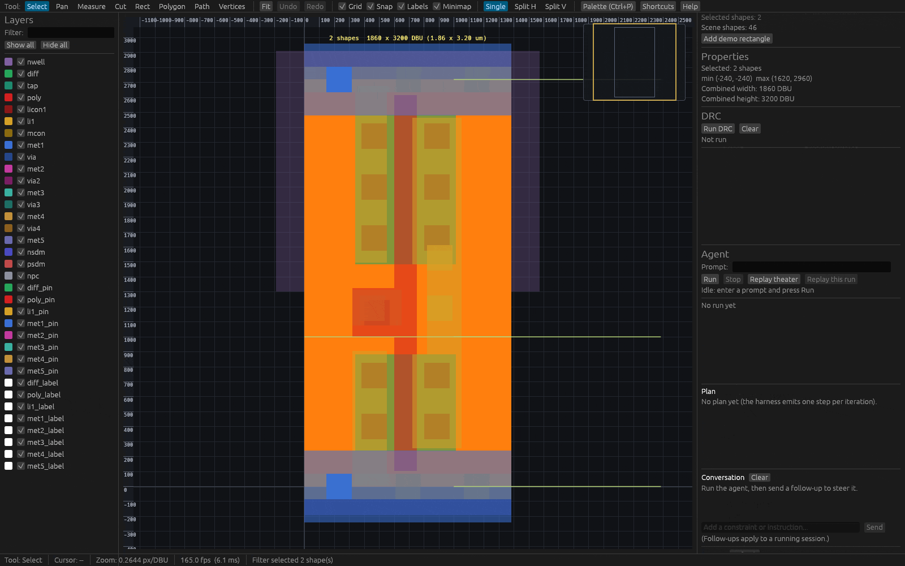
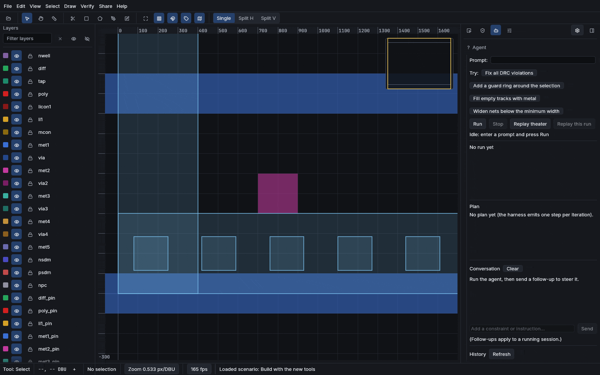
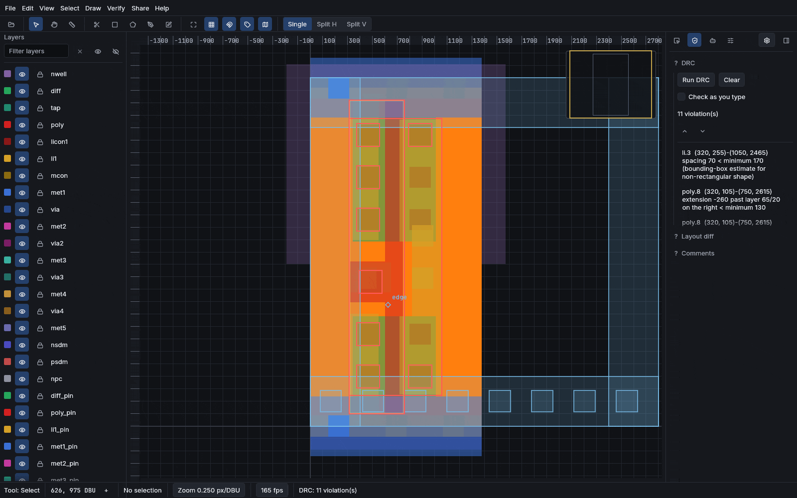
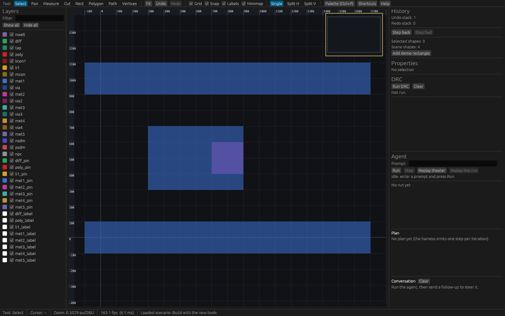
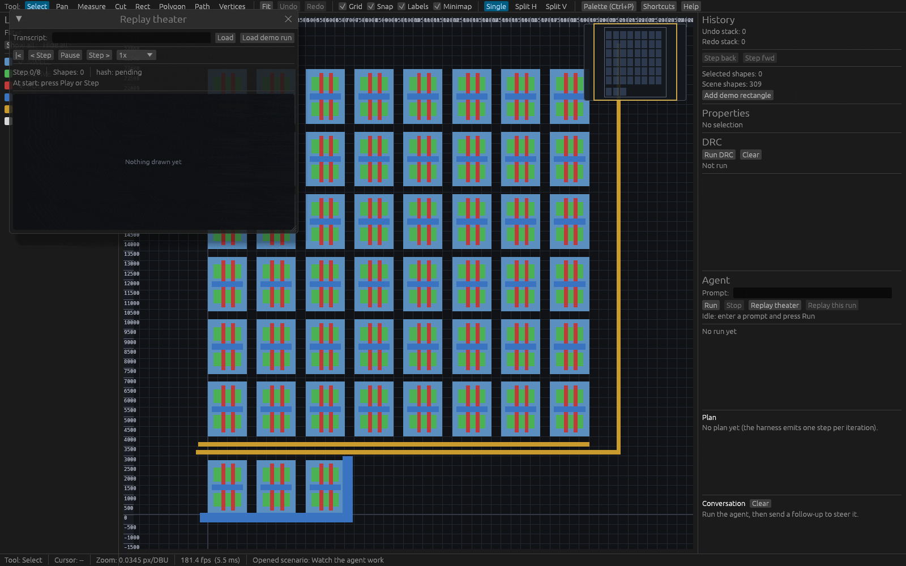
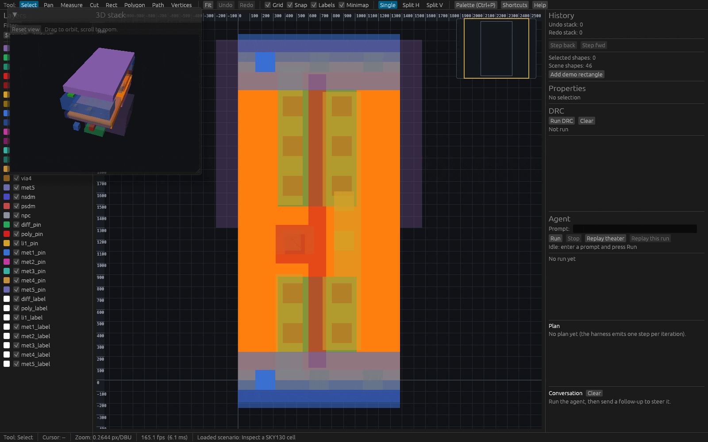

<p align="center">
  
</p>

# Reticle

[](#license)
[](https://alpharomerojl.github.io/reticle/)

A local 20B model solves 52 of 75 design-rule-verified layout tasks in this editor's
command API. The editor itself runs in your browser.

Reticle is an editor for very large hierarchical 2D layout scenes, the kind a chip's
physical design is made of. It renders and edits integer-coordinate geometry (rectangles,
polygons, and paths on named layers) organized into cells, instances, and arrays. A cell
placed thousands of times expands to billions of leaf shapes that still browse at 60 fps,
because the hierarchy is never flattened for viewing. It is written in Rust and compiled
to native and to WebAssembly from one codebase.

There are three things you can do with it, below. Then: the live demo, a quickstart, how
it works, what it does not do, and the license.

## Open and share real chips in a browser

Import a GDSII or OASIS layout and browse it at interactive speed, with nothing installed.
Open a local file, drop one onto the window, or pass `?gds=<url>` to load a stream from a
link. A session can be made read-only and shared, so a reviewer opens the exact view you
are looking at and pans it themselves without being able to change it. One click mints a
room, goes live, and copies the viewer link; a permalink (`?cell=`, `?view=x,y,z`,
`?layers=`) deep-links a specific cell, camera, and layer set on top of the file; and a
phone that opens a shared link navigates by touch (pinch to zoom, two fingers to pan).

The clip below is the query tour: a filter selects shapes by layer and size, and the
outline tree locates a cell on the canvas. This is the browse-and-inspect surface a shared
read-only session opens into. (The two-context live share is a browser-and-relay flow that
the native capture harness cannot record; this reuses the query GIF, which shows the same
viewer surface a shared session presents.)

<p align="center"></p>

## Generate verified structures from language

Six parameterized generators turn a few numbers into the repetitive structure a layout
engineer would otherwise draw by hand: a guard ring, a via farm, a pad ring, a seal ring,
a density fill, or a probe-able test structure. Each generator is a pure function from
typed parameters to geometry, and each is **DRC-clean by construction**: a property test
runs every generator over random valid parameter sets - now across **two PDKs, SKY130 and
IHP SG13G2** - and asserts zero design-rule violations under each process's real checker
(`crates/reticle-gen/tests/`). The process numbers are data (a `GenTech` derived from the
technology), not baked constants, so the same generators run against either PDK.

The same six generators surface three ways from one schema. The **Generate panel** builds
a typed form from each generator's schema, previews the geometry live on the canvas, and
places it as one undo step. The **MCP server** exposes one tool per generator (named for
its id: `guard_ring`, `via_farm`, `pad_ring`, `seal_ring`, `fill`, `test_structure`), so a
model host can call a generator with a target cell and its parameters. And a
`RunGenerator` command makes every generator run a replayable, undoable transcript edit,
exactly like a hand-drawn shape.

The clip below drives the Generate panel: pick the guard-ring generator, grow its region,
place the ring as one undoable step, then switch to the via-farm generator and place a 5x5
farm. Both structures are DRC-clean the moment they land.

<p align="center"></p>

## Benchmark agents on physically verified tasks

The same engine is drivable by an agent. A serializable command API exposes every edit,
and a propose-verify-correct harness makes a model build layouts under the real
design-rule and connectivity checks, so a task passes only when an objective checker
accepts it. Each checker is two-way tested: it must accept the intended solution and
reject a perturbed one. Every result is labeled with the backend, model, and quantization
that produced it.

The suite is [`benchmarks/layout-tasks/manifest.toml`](benchmarks/layout-tasks/manifest.toml),
now version 0.5.0, 83 tasks across five tiers (the generator tasks above are among them).
Two rows below are bare local models driven by Reticle's own propose-verify-correct loop.
The third is an agent system that brings its own loop, so it is not head-to-head
comparable.

| What it is | Detail | Result |
|---|---|---:|
| `gpt-oss:16k` (MXFP4) | a bare local model driven by Reticle's own loop | 49/83 (59%), v0.5.0 |
| `qwen2.5-coder:16k` (Q4_K_M) | a bare local model driven by Reticle's own loop | 29/83 (35%), v0.5.0 |
| Claude Code (`claude-sonnet-5`) | an agent system (its own loop) | 24/25 that ran passed (partial) |

The two local rows are the full 83-task v0.5.0 suite. They are small quantized local
models, so the numbers are a floor, not an upper bound.

The distinction the table makes is real. The two local models are *bare models*: Reticle
supplies the loop, feeds the checker's violations back, and decides when a task passes.
Claude Code is an *agent system* with its own planning-and-tool loop, so pointed at
Reticle's MCP server it does not run the same harness the two local rows do; its row is not
a like-for-like comparison. It is a real authenticated run, not a fabricated score, but a
**partial** one: 25 of the 83 tasks ran (tiers 1 through 3) and 24 passed before the
subscription rate limits stopped the run, so its denominator differs from the full-suite
local rows and the tier 4 and 5 tasks were not reached. Per task the harness launches
`reticle-mcp`, runs `claude -p` over it, replays the captured transcript, and runs the
task's checker; a rate-limited or unauthenticated session is recorded as an honest not-run,
never a pass or fail. To run the full suite when the rate window is clear:
`just bench-agent-claude-code` (on Windows set `RETICLE_CLAUDE_BIN` to the resolved
`claude.cmd` and `RETICLE_MCP_BIN` to a current `reticle-mcp`). See
[Benchmark methodology](docs/src/benchmark.md) for how a run is scored and replayed.

## The live demo

**[Open the live demo.](https://alpharomerojl.github.io/reticle/)** It runs entirely in
your browser on WebGPU and WebAssembly. Use current Chrome or Edge for the WebGPU path;
the app falls back to WebGL2 elsewhere. The page opens into a recorded
propose-verify-correct run playing in the replay theater, with the full editor one click
away.

Each clip below is a full-window capture of the running application, produced by
`just capture-ui` from a committed script under
[`crates/reticle-app/demo-scripts/`](crates/reticle-app/demo-scripts/).

**Find and fix a design-rule violation.** Run DRC, the violation list fills, click one,
the canvas frames its marker.

<p align="center"></p>

**Draw and edit real geometry.** Draw a polygon, drag a vertex, boolean-union two shapes,
then array-duplicate the result. Every step is one undoable edit.

<p align="center"></p>

**Watch the agent close the loop.** The replay theater plays a recorded run: the narration
feed advances and the violation counter reaches zero.

<p align="center"></p>

**See it in 3D.** Switch to the layer-stack view and orbit the extruded metals.

<p align="center"></p>

## Quickstart

Prerequisites: a recent Rust toolchain (see `rust-toolchain.toml`) and
[`just`](https://github.com/casey/just). A WebGPU-capable browser (current Chrome or Edge)
is needed for the web demo. The local-model benchmark additionally needs a running
[Ollama](https://ollama.com) endpoint.

```sh
# Build everything and run the full local gate (style, format, clippy, tests, docs, wasm,
# licenses, spelling). There is no CI service; this recipe is the gate.
just ci

# Native application.
cargo run -p reticle-app --release

# Web demo (WebGPU with a WebGL2 fallback), served locally.
just web-serve

# Regenerate the README media (hero still plus the tour GIFs) from committed demo scripts.
just capture-ui

# Headless pipeline: import, DRC, route, extract, export, render-to-image.
cargo run -p reticle-cli --release -- --help

# Generate a deterministic chip-like layout to browse or benchmark.
just gen-layout 1000000 8 3 scratch/gen.gds

# Score the agent across the suite (deterministic mock by default).
just bench-agent

# Score it against a LOCAL model via Ollama (set the model first).
# $env:RETICLE_MODEL_NAME = 'gpt-oss:16k'
just bench-agent-ollama

# Score it through Claude Code (needs an authenticated `claude` CLI on PATH).
just bench-agent-claude-code
```

## How it works

**Hierarchy culling.** Geometry is indexed in a bulk-loaded R-tree and a tile/level-of-detail
pyramid. Hierarchy is never flattened to browse; each cell's bounding box is computed once,
and rendering culls whole instances and arrays that fall outside the view. A compute shader
flags which cell boxes overlap the viewport, a workgroup scan compacts the survivors into an
indirect-draw buffer, and one indirect draw paints them, so the draw count comes from the GPU.
The retained renderer caches per-cell tessellation once and uploads geometry to fixed-size
GPU pages, so each frame is a draw, not a rebuild; that lifts a 10,000,000-leaf-shape scene
from 6.1 to about 113 fps on an RTX 4060 Ti (see [PERF.md](docs/PERF.md)).

**Design-rule checking.** A declarative engine evaluates width, spacing, enclosure,
extension, notch, area, density, and angle rules against the indexed geometry. On an edit it
re-checks only the changed neighbourhood: 5 us at 100k shapes and 37 us at 1M, against the
100 ms interactive target. A property test pins the engine to a naive reference oracle over
400 random layouts. A cited SKY130 rule subset grounds the periphery rules. A documented
subset of KLayout `.lydrc` DRC decks compiles down to the same engine, validated
verdict-for-verdict against KLayout headless in the pinned container.

**Metrology.** _(placeholder row, pending the Wave 3 merge.)_ A CPU metrology pass reports
exact per-layer area and perimeter (union on the `i_overlay` integer engine, overlaps counted
once), connectivity statistics (net count, shapes per net, max fanout), and a simplified
per-net antenna ratio over a SKY130 layer subset, exported to byte-stable CSV and Markdown. A
property test pins area and perimeter to a coordinate-compression oracle. The GPU density
overlay is deferred; see [ADR 0074](docs/decisions/0074-cpu-metrology-reports.md).

**Installable PWA.** The browser bundle is an installable Progressive Web App whose app shell
loads offline: a relative web manifest, a service worker that caches the shell and the hashed
wasm bundle (network-first navigation, cache-first assets, cache scope derived from
`self.registration.scope`), and registration wired into `index.html`. Every path is relative, so
it is correct at the dev root and under the gh-pages `/reticle/` subpath; a Playwright e2e proves
the manifest, the registration, and an offline shell reload. See
[ADR 0078](docs/decisions/0078-installable-pwa-app-shell-offline.md).

**Layout diff.** A pure `reticle-diff` crate answers "what changed between two versions?":
`diff(before, after)` compares the flattened top cells as multisets keyed by exact geometry and
reports the shapes added, removed, and (deferred in v1) changed. Property tests pin it, including a
single-insertion oracle. The app paints the result over the canvas (added green, removed red,
changed amber) with a show/hide toggle, fed by a snapshot/diff flow over two in-memory documents. A
comparison-document file loader and a true `changed` classification are deferred; see
[ADR 0079](docs/decisions/0079-layout-diff-overlay.md).

**Comments and annotations.** Notes anchored to a shape or cell persist inside the layout
document through a schema bump, V1 to V2. The new `comments` field is additive, so every pre-V2
document still decodes, and `migrate_document` upgrades a V1 document to V2 losslessly. The migration
is proven against a golden fixture captured and committed from the pre-V2 build *before* the schema
was edited: a test decodes those real pre-V2 bytes with the V2 code and asserts the geometry is
byte-for-byte identical across the migration. The app lists comments and paints a numbered pin at
each anchor; wiring the in-app pins into document save/load (and the CRDT) is deferred. See
[ADR 0080](docs/decisions/0080-comments-schema-v1-v2-migration.md).

**Multi-writer collaboration.** Several editors' edits merge and converge to a byte-identical
document, and each editor's undo is *selective*: it tags local edits with a per-actor CRDT origin
and drives a `yrs` undo manager scoped to that origin, so undo reverts only that editor's own last
edit, leaves a concurrent peer's edit intact, and still reconverges after exchange. Read-only is
enforced in depth: the relay drops a view-mode connection's frames (native and Durable Object
worker alike) and the viewer transport has no publish method at all. Proven natively (two-writer
convergence, selective-undo-then-reconverge, redo convergence) and end-to-end over the relay (two
editors converge, a viewer sees the union but its write is dropped). Making the in-app editor
CRDT-backed so it merges inbound peer edits live is deferred. See
[ADR 0081](docs/decisions/0081-multi-writer-convergence-view-permission-selective-undo.md).

**Generators.** Each of the six generators is a pure function from a typed `ParamSchema` to
geometry. One schema drives all three surfaces (the Generate panel, the MCP tools, the
benchmark checker), and a property test runs every generator over 400 random valid parameter
sets and asserts zero DRC violations, so the structures are clean by construction rather than
by inspection.

**The agent verify loop.** A serializable command API exposes every edit as a replayable
transcript with a document hash. The harness drives a model against the SKY130 DRC subset and
a connectivity intent, feeds the violations back, and stops only when an objective checker
passes. For a local repair it can hand the model a region-scoped context pack instead of the
whole layout, and a user can fold a new constraint into the running loop between iterations.

**Multimodal verification.** A second, best-effort oracle renders a task's layout through
the same headless `RenderPng` path and asks a local vision model (`llava:7b` over Ollama,
about 4.7 GB resident) a yes/no question about the render, reported beside the authoritative
DRC/checker oracle as an agreement rate (ADR 0090). The graded pass/fail
stays the deterministic checker's; the vision verdict is corroboration, not the verdict of
record. A missing model or a host with no GPU is an honest not-run, never an error and never
a fabricated number. On the development host the live oracle ran (`llava:7b`) and agreed with
the authoritative checker on both fixtures of a faithful-versus-empty pair.

**CRDT sync.** The document mirrors onto a `yrs` CRDT with unique `actor:counter` keys, so
concurrent edits converge regardless of delivery order, proven by order-independent
convergence tests. A thin relay broadcasts updates and presence; edits made offline
reconcile on reconnect. A remote edit echoes to a peer in about 788 us on the localhost relay.

**LEF/DEF import.** A `reticle-lefdef` crate reads the technology and macro abstracts (LEF)
and the placed, routed design (DEF) an OpenROAD run emits, and lowers them to the document
plus the run metadata a viewer overlays (die area, rows, sites, nets with per-net segments,
and pins). It parses a defined subset (ADR 0082), skips the rest with a warning instead of
failing, and never panics or hangs on malformed input. It carries no external dependency, so
it builds for the browser alongside the rest. The import is cross-checked against OpenROAD
running in a pinned container (ADR 0088): a faithful import matches the tool on macro,
component, and pin counts and the die area, a corrupted DEF diverges, and the check skips
honestly when Docker is absent. The live cross-check ran on the development host in about
22 seconds.

**In-browser conversion.** _(placeholder row, pending the Wave 6 merge.)_ The browser
converts a GDS to a streamable `.rtla` archive itself, with no server and no upload: a Web
Worker runs the frozen streaming GDS reader and an additive in-memory archive builder
(`build_rtla_to_vec`, byte-identical to the native builder for browser-scale layouts),
writes the archive into the Origin Private File System (OPFS), and reopens it through the
existing `?archive=` streaming path via a service-worker Range bridge. It mirrors the
native converter's v1 flatten and leveling scope (ADR 0072); very large dies stay a
native-converter job. OPFS is used honestly (a secure context and a Worker), and the
`browser-convert` e2e proves the full path headless. See
[ADR 0091](docs/decisions/0091-in-browser-gds-to-rtla-conversion-opfs.md).

## What it does not do, and where it is thin

Reticle is a portfolio-grade engineering project and a research vehicle for machine-driven
layout, not a production EDA tool. It is honest about its edges, audited in
[docs/STATUS.md](docs/STATUS.md):

- No logic or physical synthesis, no timing (no STA, no parasitic extraction), and no
  tape-out signoff. Extraction is geometric net connectivity plus SKY130 MOSFET
  recognition (poly over diffusion) with a device-level LVS-lite that compares device
  count and terminal nets, checked against Magic's own extraction of a production
  inverter; it stops short of device-parameter and parasitic matching, so it is not a
  full LVS. The SKY130 DRC subset is a fast first filter, not tape-out clean.
- The benchmark is small quantized local models, a realistic floor rather than a ceiling.
  The Claude Code row is not run here (the CLI is unauthenticated) and is not head-to-head
  comparable with the bare-model rows in any case.
- The in-editor "ask the agent to fix this violation" button scopes the run by narration,
  not yet by a hard region constraint on the model.
- The fuzz targets are committed but libFuzzer does not link under Windows/MSVC; parser and
  boolean robustness are covered instead by proptests in the gate. Run the fuzzers on Linux.
- OASIS round-trips rectangles, polygons, paths, instances, and arrays; GDSII carries the
  full hierarchy.
- A streamed-archive path (`.rtla`) is landing as infrastructure: a forward-only GDSII
  record reader with no `gds21` dependency (wasm-clean) and an external, bounded-memory
  tiled-archive builder that turns a 30M-entry layout into an archive at 127 MiB peak RSS.
  The in-browser residency and converter that consume it are separate Wave 2 lanes.

For where Reticle sits among layout tools and the full list of non-goals, see
[Positioning](docs/src/positioning.md).

## Tech stack

Rust, `wgpu` (WebGPU / Vulkan / Metal / DX12 with a WebGL2 fallback), `egui` and `eframe`
(with an `egui-wgpu` paint callback for the canvas), `i_overlay`, `rstar`, `gds21`, `lyon`,
`yrs`, `axum`, `prost`, `rhai`, `pathfinding`, `criterion`, `proptest`, and `cargo-fuzz`.

## License

Dual-licensed under either of

- Apache License, Version 2.0 ([LICENSE-APACHE](LICENSE-APACHE))
- MIT license ([LICENSE-MIT](LICENSE-MIT))

at your option.
