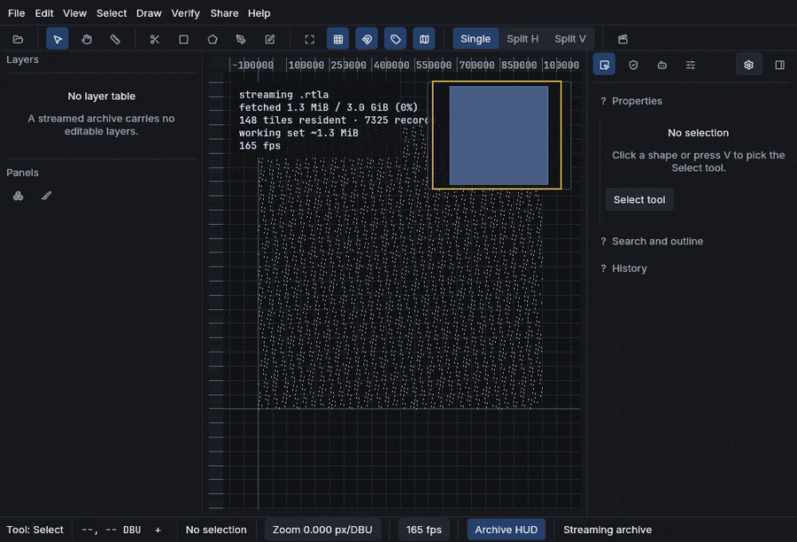
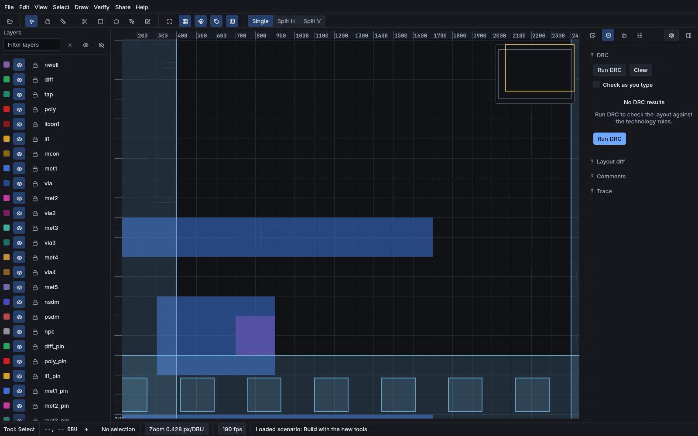
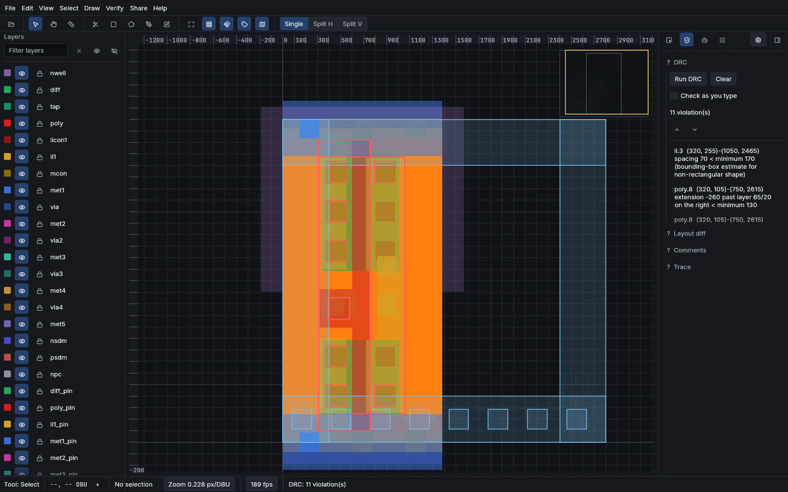
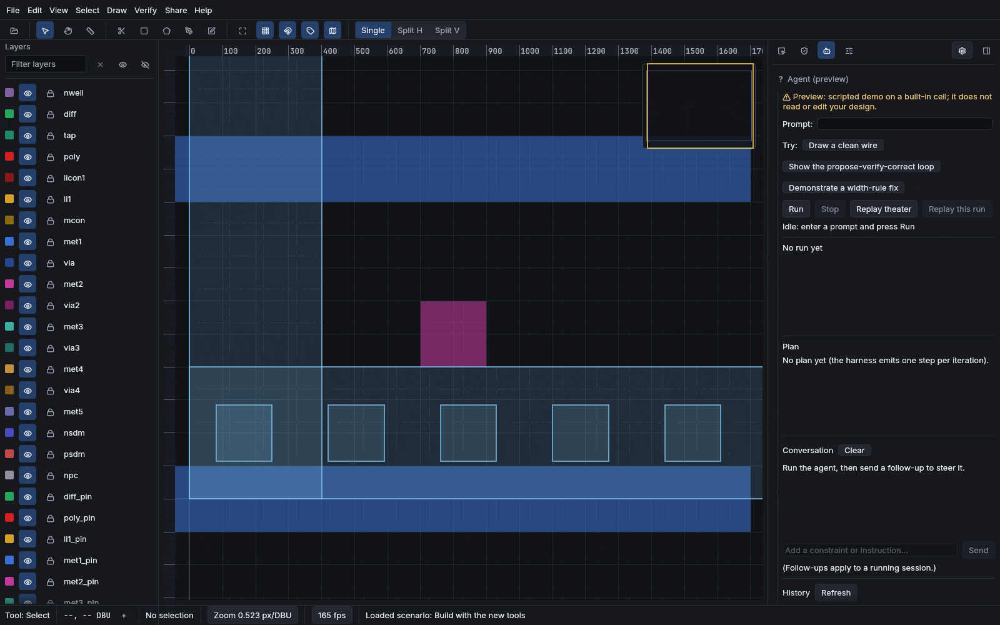
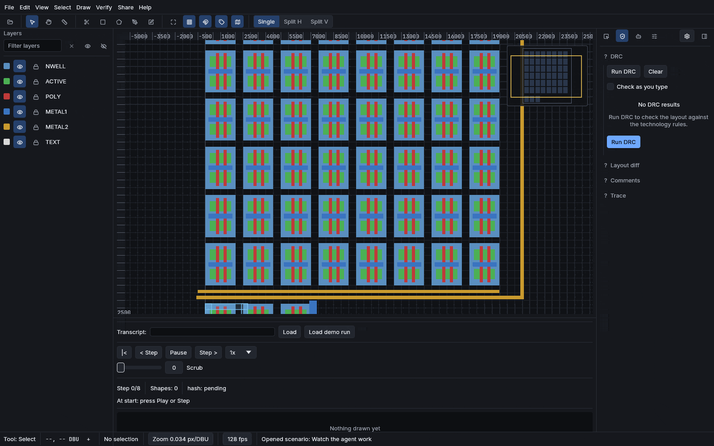
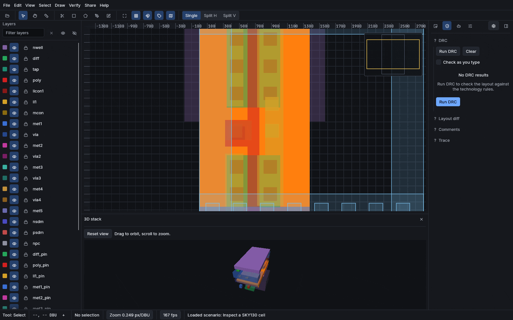

# Reticle

**Open a real chip in your browser.**

A chip's physical design is a few billion rectangles placed with nanometer care.
Reticle is an editor for that world, and it runs entirely in a browser tab: it
streams a 3.01 GiB layout by fetching 188 KiB, checks design rules in microseconds
as you type, and lets anyone walk your exact view from a link. Nothing to install.
Your files never leave your machine.

[](https://alpharomerojl.github.io/reticle/)
[](https://alpharomerojl.github.io/reticle/)
[](https://alpharomerojl.github.io/reticle/)
[](#license)
[](https://github.com/sponsors/AlpharomeroJL)



## Try it in sixty seconds

1. **[Open the streaming demo.](https://alpharomerojl.github.io/reticle/?archive=https://reticle-archive.josefdean.workers.dev/f04af90fbb06786c.rtla)**
   A 3.01 GiB archive starts streaming immediately; the HUD in the corner shows
   exactly how few bytes that takes (188 KiB for the first view, 0.006% of the file).
2. **Open the gallery.** Every die in it is real fabricated open silicon,
   license-verified before it ships; today that is one die, SkyWater's `sky130`
   inverter, alongside an excluded fixture that proves the license gate. The
   fetch-convert-verify-exclude pipeline that placed it can add more as they clear
   licensing. Zoom until you hit the transistors.
3. **Share what you found.** Copy a permalink to the exact cell, camera, and layers
   you are looking at. Whoever opens it sees what you see, pans it themselves, and
   cannot change a thing.

Works today in Chrome and Edge on WebGPU, and falls back to WebGL2 in other current
browsers.

## The numbers that make it work

Every figure here is measured, not estimated. Most trace to a committed test or
bench you can run; the live streaming figures are a reading from the
`window.__reticle_stats` seam on the deployed demo.

- **Streaming:** a 3.01 GiB archive browses over plain HTTP Range from static
  hosting. First view: 188 KiB fetched, 0.006% of the file, reported live in the
  streaming HUD. Separately, the converter turns a 30M-entry layout into a tiled
  archive at 127 MiB peak RAM.
- **Scale:** 10,000,000 leaf shapes render at about 113 fps on an RTX 4060 Ti, up
  from 6.1 fps before the retained renderer (the native offscreen render bench; see
  `docs/PERF.md`). Hierarchy is never flattened to
  browse; a cell placed thousands of times stays one cell.
- **Verification speed:** an edit re-checks only its neighbourhood: 5 us at 100k
  shapes, 37 us at 1M, against a 100 ms interactivity budget. Design rules run while
  you type, like a spellchecker.
- **Referee-checked:** a documented subset of KLayout DRC decks runs on Reticle's
  engine and is validated verdict-for-verdict against KLayout headless in a pinned
  container. LEF/DEF import is cross-checked against OpenROAD the same way. The
  official TinyTapeout precheck runs on a committed tile, and every Magic and KLayout
  DRC and geometry check in it passes; the pin and Verilog checks that need
  submission artifacts a geometry tile does not produce do not, and no tile here is
  claimed to pass the precheck in full. The incumbents are the referees, on purpose.

## Who it is for

| You are | Reticle gives you |
|---|---|
| Curious what a chip actually looks like inside | The gallery. Real silicon, one click, zoom to the wires |
| A TinyTapeout or open-shuttle participant | Your tile in a tab, the official precheck run on it, and a share link for showing it off |
| An analog or full-custom designer | User-defined PCells with typed parameters and sandboxed produce scripts, net trace, shorts and opens, SPICE export, xschem probe import |
| A reviewer on an open-silicon repo | A rendered layout diff of what changed, painted over the canvas, and a pull-request diff Action (authored, not yet exercised on live CI) |
| An instructor | Classroom mode: students follow your viewport live, view-only until you unlock them. The whole lab is a URL |
| A researcher studying agents on real tasks | A frozen, citable benchmark with checkers that must reject wrong answers, and a deterministic public leaderboard |
| On a locked-down or offline machine | The desktop build runs the same editor with the network unplugged |

## What you can do

**Open and share real chips.** Import GDSII or OASIS, drop a file on the window, or
pass `?gds=<url>`. A permalink (`?cell`, `?view`, `?layers`) deep-links the exact
cell, camera, and layers on the static site with no server. Live rooms add real-time
sharing: one click mints a read-only viewer link, and the viewer materializes your
design as you edit it and cannot write back, enforced at the transport, not the UI.
That live path is proven end to end over the relay in tests; the public demo's relay
endpoint is operator-configured (see `docs/honest-limits.md`), so live sharing is a
capability rather than a guaranteed feature of the hosted demo. Phones navigate
shared links by touch.

**Edit with guardrails.** Rectangles, polygons, paths, cells, arrays, on three real
PDKs: SKY130, IHP SG13G2, and GF180MCU. DRC underlines violations as you draw.
Boolean ops, vertex editing, array duplication, all one undo step each.





**Generate instead of drawing.** Six built-in generators (guard ring, via farm, pad
ring, seal ring, fill, test structure) are DRC-clean by construction: a property
test sweeps each across random valid parameters on all three PDKs and asserts zero
violations under each process's real checker. **User-defined PCells** extend that:
typed parameters, a sandboxed Rhai produce function with an operation budget and
memory cap, instance caching, and DRC checked on every generate before the result
commits. Live produce runs in the desktop app; in the browser the inspector edits an
instance's parameters and shows predicted provenance, and says so.



**Review where the work lives.** A `reticle-diff` pass compares two versions and
paints what changed over the canvas (added green, removed red), pinned by property
tests including a single-insertion oracle. A composite layout-diff GitHub Action is
authored to render a before/after into a pull request; it is valid YAML and reasoned
through, not yet run on live GitHub Actions (this repo ships no workflows; recorded
in `docs/honest-limits.md`). Comments anchor to a shape or cell and survive a document
schema migration proven byte-for-byte against a pre-migration fixture.

**Trace and verify.** Click a shape, light up its net. Shorts and opens report into
the Inspector. MOSFET recognition with LVS-lite, SPICE netlist export with per-PDK
model names carried as data, antenna and area metrology to byte-stable CSV.

**Automate it.** Every edit is a serializable, replayable command with a document
hash. An MCP server exposes 39 tools, the Python bindings display a layout inline in
a Jupyter notebook, a sandboxed Rhai producer builds user-defined PCells, and the
CLI runs the whole pipeline headless. The in-editor agent panel plans, waits for
your approval, executes, and replays; on native with a key or a local Ollama it
drives a real model, and the web build shows a scripted preview and says so.



**Extend it.** Sandboxed WASM plugins with declared permissions gated at
instantiation, memory and fuel limits, and writes only through the same staged-edit
funnel as every other input, so a plugin cannot make an edit that is not undoable
and replayable. Plugins run in the desktop app; the browser build lists and previews
the committed plugin index behind an in-UI disclaimer and never runs one (the
runtime, `wasmi`, ships zero browser bytes). The package index is a deterministic
file committed to this repo. No accounts, no server.

**Take it anywhere.** Installable PWA with an offline shell. A desktop build for
air-gapped review. An `?embed=1` mode drops the read-only viewer into an iframe, a
course page, or a paper, with an "Open in Reticle" corner link back to the full
editor.



## The benchmark: how we know what works

Machine-edited layout is only interesting if you can prove an edit is correct, so
Reticle ships the proving apparatus: the suite is
[`benchmarks/layout-tasks/manifest.toml`](benchmarks/layout-tasks/manifest.toml),
frozen and citable at version 0.7.0, 95 tasks across five tiers, where a task passes
only when an objective design-rule and connectivity checker accepts it. Every
checker is **two-way tested**: it must accept the intended solution and reject a
perturbed one before it is allowed to grade anything. The leaderboard is generated
deterministically from committed records; every recorded row replays green before it
counts.

| What it is | Suite it ran | Result |
|---|---|---:|
| `claude-sonnet-5` via Claude Code, an agent system (its own loop) | 0.7.0 (53 of 95 recorded) | 48/53 (91%) |
| `gpt-oss:16k` (MXFP4), a bare local model on Reticle's own loop | 0.4.0 (75 tasks) | 52/75 (69%) |
| `qwen2.5-coder:16k` (Q4_K_M), a bare local model on Reticle's own loop | 0.4.0 (75 tasks) | 29/75 (39%) |
| `claude-sonnet-5` via Claude Code, an earlier ad-hoc run | adhoc (81 of 83 recorded) | 72/81 (89%) |

Bare-model rows run Reticle's loop; agent systems bring their own, so the two are
never compared head-to-head, and rows are never compared across denominators. The
featured Claude Code row is a real authenticated run against the current frozen
v0.7.0 suite: 48 of 53 recorded tasks passed across all five tiers. The denominator
is 53, not 95, because the remaining 42 tasks were never recorded when the
subscription rate limits stopped the run; an unrecorded task is an honest not-run,
never a pass and never a fail. A gym-style RL environment wraps the editor (reset,
step, reward-from-checker, replayable episodes) for anyone who wants to train
against it. This is verification infrastructure: the editor is a normal editor, and
you never have to touch the agents. See
[the leaderboard](docs/src/leaderboard.md) for the aggregated records and
[Benchmark methodology](docs/src/benchmark.md) for how a run is scored and replayed.

## Two promises

**Links are load-bearing.** A permalink you share today is meant to open in ten
years. Link rot is treated as a bug with the same severity as a rendering bug,
because a shared link that dies takes someone's forum answer, course page, or code
review with it.

**Your files stay yours.** Opening a local GDS converts it in a Web Worker inside
your browser; nothing uploads. The proof is not this paragraph, it is your network
tab: open a file and watch zero bytes of it leave.

## How it compares

As of 2026-07-12, the nearest browser-native neighbours are GDSJam, a collaborative
GDS viewer, and Layout Studio, a browser GDS and OASIS editor with draw tools and a
basic minimum-spacing and feature-size design-rule check that runs on the open file.
Searching for prior art on that date, no browser tool was found that combines all
three of editing, incremental design-rule checking at microsecond latency, and
streaming a multi-gigabyte layout over the network; and no other physically verified
layout-agent benchmark with a public leaderboard was found. These are
absence-of-evidence judgments with a date attached, not proofs. If you know a
counterexample, open an issue. I would like to read it.

|  | Reticle | KLayout | Magic | Commercial (Virtuoso-class) |
|---|---|---|---|---|
| Runs in a browser, zero install | yes | no | no | no |
| Live multiplayer, per-actor undo | yes | no | no | no |
| Incremental DRC while typing | microseconds | no | yes (corner-stitching) | in-design, full decks |
| User-defined PCells | yes, sandboxed scripts | yes, Ruby/Python | partial | yes, SKILL |
| Agent API + verified benchmark | yes | no | no | no |
| Full-deck signoff DRC/LVS | no, and not a goal | via decks | yes | yes |
| Timing, parasitics, tape-out signoff | no | no | partial | yes |

Reticle does not compete on signoff depth. It competes on access, collaboration,
scale-in-a-tab, and machine-checkability, and it uses KLayout, Magic, and OpenROAD
as its own referees.

## Quickstart

Prerequisites: a recent Rust toolchain (see `rust-toolchain.toml`) and
[`just`](https://github.com/casey/just). A WebGPU-capable browser (current Chrome or
Edge) is needed for the web demo. The local-model benchmark additionally needs a
running [Ollama](https://ollama.com) endpoint.

```sh
# Build everything and run the full local gate: style, format, clippy, tests,
# docs, wasm, licenses, spelling. There is no CI service. This recipe is the gate.
just ci

# Native application.
cargo run -p reticle-app --release

# Web demo (WebGPU with a WebGL2 fallback), served locally.
just web-serve

# Desktop build (offline-complete Tauri shell). Build the web bundle first;
# the shell embeds crates/web/dist at compile time.
just web-build
cd desktop && cargo build

# Headless pipeline: import, DRC, route, extract, netlist, export, render.
cargo run -p reticle-cli --release -- --help

# Exercise the user-defined-PCell property harness (typed params, sandboxed Rhai
# produce, DRC checked on every generate); the shipped example is
# crates/reticle-script/examples/param_cell.rhai.
cargo nextest run -p reticle-script

# Run the official TinyTapeout precheck on a committed tile.
just tt-precheck examples/tapeout/tt_um_reticle_tile.gds

# Score an agent across the suite (deterministic mock by default).
just bench-agent
```

## How it works

<details>
<summary><b>Streaming</b>: 3.01 GiB archive, 188 KiB first view</summary>

A forward-only GDSII record reader (wasm-clean) feeds a bounded-memory tiled-archive
builder: a 30M-entry layout becomes a tiled archive at 127 MiB peak RSS. The browser
streams an archive over HTTP Range, reading only the header, the directory, and the
tiles the viewport needs; the first view of the live 3.01 GiB archive fetched
188 KiB. Library dies are served from R2 behind an edge cache with content-hash keys;
every die carries a license manifest verified before upload, and unverifiable dies
are excluded rather than shipped.
</details>

<details>
<summary><b>Rendering</b>: hierarchy is never flattened</summary>

Geometry lives in a bulk-loaded R-tree and a level-of-detail pyramid. A compute
shader flags which cell boxes overlap the viewport, a workgroup scan compacts
survivors into an indirect-draw buffer, and one indirect draw paints them, so the
draw count comes from the GPU. Per-cell tessellation is cached once; each frame is a
draw, not a rebuild. See [`docs/PERF.md`](docs/PERF.md) for the measurement
methodology behind every fps number above.
</details>

<details>
<summary><b>DRC</b>: microseconds per edit, pinned to an oracle</summary>

A declarative engine evaluates width, spacing, enclosure, extension, notch, area,
density, and angle rules, re-checking only the changed neighbourhood. A property
test pins it to a naive reference oracle over 400 random layouts. Per-PDK subsets
ship as data for all three PDKs, each two-way tested: a seeded violation is caught,
the corrected layout passes. The subsets are a fast first filter, not tape-out
clean, and this README will keep saying so.
</details>

<details>
<summary><b>PCells</b>: sandboxed produce, checked on generate</summary>

A PCell is typed parameters plus a Rhai produce function running under an operation
budget and memory cap with no I/O. It emits into a staging cell, DRC runs on the
result, and only then does it commit, as one undo step. Instances are cached on
(pcell id, engine version, canonical parameter hash) and invalidated when the
script's content hash changes. A property harness sweeps parameter ranges per PDK
and shrinks failures to a minimal offending set. The honest claim split: the six
shipped generators and shipped example PCells are clean by construction under the
harness; your PCells are DRC-checked on every generate. Live produce is native-only
(the Rhai crate is the single largest dependency and stays out of the browser
bundle).
</details>

<details>
<summary><b>Collaboration</b>: CRDT convergence, review, classroom</summary>

The document mirrors onto a `yrs` CRDT with actor:counter keys; concurrent edits
converge regardless of delivery order, and undo is per-actor: yours reverts, your
collaborator's stays, and the documents still reconverge. Read-only viewers have no
publish method at all, enforced at the transport (native relay and Cloudflare
Durable Object alike). Convergence, selective undo, and the dropped-viewer-write are
proven natively and end to end over the relay; the public demo's relay endpoint is
operator-configured and may not be live, tracked in `docs/honest-limits.md`. The
classroom instructor roster is
honestly empty until a write-capable presence path lands; the student-follow half is
real today.
</details>

<details>
<summary><b>Formats</b>: read the world, write it back</summary>

GDSII read/write, hardened and fuzzed, every stream-supplied count capped against
remaining input. OASIS read and write, round-trip property tested both directions
and validated by KLayout reading the output back. CIF and DXF subset import. LEF/DEF
import cross-checked against OpenROAD in a pinned container. STL/GLTF export of the
3D layer stack. Image underlay aligns a licensed die photo under its own layout with
a two-point affine fit.
</details>

<details>
<summary><b>The verify loop</b>: propose, check, correct</summary>

Every edit is a replayable transcript entry with a document hash. The harness drives
a model against the real DRC subset and a connectivity intent, feeds violations back,
and stops only when the objective checker passes. A second, best-effort vision
oracle corroborates renders but is never the verdict of record; a missing model is an
honest not-run, never a fabricated number.
</details>

## What it does not do

Reticle is honest about its edges; the audited list lives in
[`docs/STATUS.md`](docs/STATUS.md), with a completeness ledger in
[`docs/honest-limits.md`](docs/honest-limits.md).

- No synthesis, no timing, no parasitic extraction, no tape-out signoff. LVS-lite
  compares device counts and terminal nets; it is not a full LVS. The DRC subsets
  are fast first filters.
- SoC-scale place-and-route belongs to OpenROAD; Reticle visualizes P&R output and
  does not compute it.
- The plugin ABI is v0 and will break. The index is a committed file, not a hosted
  registry.
- Native mobile editing is out of scope; touch viewing and annotation stay.
- A bounded pure-Rust MNA oracle simulates small extracted circuits (linear R/C/L
  and independent sources, DC operating point and fixed-step transient). It is not
  ngspice, is labeled that way everywhere, and is never signoff.

## Star, sponsor, correct me

If this is useful or just cool, star the repo; it is genuinely how the next person
finds it. Found a chip the gallery should carry, a claim that needs correcting, or a
counterexample to the comparison above? Open an issue. Development is one person plus
a lot of verification; you can support it on
[GitHub Sponsors](https://github.com/sponsors/AlpharomeroJL).

Every public number is measured, not estimated.

## Tech stack

Rust, `wgpu` (WebGPU, Vulkan, Metal, DX12, WebGL2 fallback), `egui` and `eframe`,
`i_overlay`, `rstar`, `gds21`, `lyon`, `yrs`, `axum`, `prost`, `rhai`, `wasmi`,
`pathfinding`, `criterion`, `proptest`, `cargo-fuzz`.

## License

Dual-licensed under either of

- Apache License, Version 2.0 ([LICENSE-APACHE](LICENSE-APACHE))
- MIT license ([LICENSE-MIT](LICENSE-MIT))

at your option.
