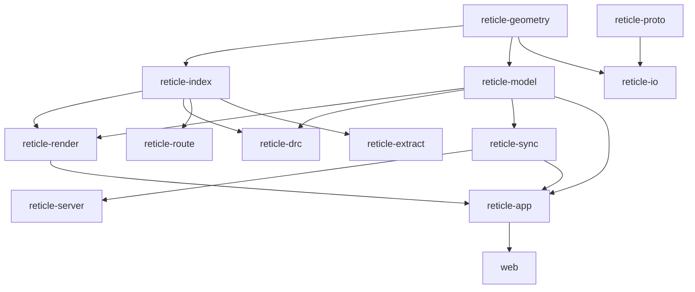

<p align="center">
  
</p>

# Reticle

[](#license)
[](https://alpharomerojl.github.io/reticle/)

**[Try the live demo](https://alpharomerojl.github.io/reticle/)**, it runs entirely in your browser via WebGPU and WebAssembly (use a current version of Chrome or Edge).

Reticle is a browser-native, GPU-accelerated editor for very large hierarchical 2D
layout scenes, written in Rust and compiled to both native and WebAssembly. It
renders and edits integrated-circuit geometry (rectangles, polygons, and paths on
named layers), organized into cells, instances, and arrays, so a small cell placed
thousands of times yields effectively billions of leaf shapes that still browse at
interactive frame rates.

On top of the geometry sit CAD-style pan, zoom, select, measure, and annotate
tools, a design-rule checker, a router, connectivity extraction, GDSII and OASIS
import and export, embedded scripting, and real-time multi-user collaboration.

<p align="center">
  
</p>

> Status: v4.0.0 brings the interactive GPU canvas on screen (a retained scene that
> renders 10,000,000 leaf shapes at about 113 fps, up from 6.1), a GPU-driven draw
> list, canvas text, a minimap, split viewports, rebindable keys, and a 3D
> layer-stack view. The workspace is green under the local gate (`just ci`). For a
> skeptical, audited account of exactly what is fully implemented, what is partial,
> and how to verify each claim yourself, see [docs/STATUS.md](docs/STATUS.md).

## Why it is interesting

It works the exact problem a semiconductor tooling team solves: visualizing and
editing massive layout geometry at interactive speed. That pulls together
performance engineering, computational geometry, GPU rendering, spatial indexing,
schema evolution, and distributed collaboration in one codebase.

The north-star demo: open a dense chip-like layout of over one million polygons in
a browser, pan and zoom at 60 fps, measure a spacing, run an incremental
design-rule check and jump to a violation, drop an annotation, and watch a second
user's cursor and edits appear live.

## Features

- Exact integer (database-unit) geometry with robust polygon booleans, offsetting,
  and convex decomposition, validated against a brute-force winding-number oracle.
- Hierarchy: cells, instances, and arrays with nested transforms, flattening,
  per-cell bounding boxes, and cell-level culling for scale.
- GPU rendering on `wgpu`, on screen and offscreen: the interactive canvas draws
  through an `egui-wgpu` paint callback on eframe's device, with a retained scene that
  caches per-cell tessellation once, expands instances into a per-instance transform
  buffer, and stores geometry in fixed-size GPU pages so a camera move rewrites a single
  uniform rather than a buffer. A GPU-driven draw list culls cell bounding boxes in a
  compute shader, compacts the survivors with a workgroup scan, and issues an indirect
  draw; 4x MSAA and zoom-driven level-of-detail are in the pipeline. On top sit canvas
  text labels, a minimap, split viewports, rebindable keybindings, live DRC and net
  overlays, and a 3D layer-stack view with a cut-line cross-section. See
  [docs/STATUS.md](docs/STATUS.md) for the audited per-feature status.
- Spatial indexing: a bulk-loaded R-tree, a uniform grid, and a tile/LOD pyramid,
  with point, rectangle, nearest-edge, and k-nearest queries.
- Design-rule checking: a declarative engine (width, spacing, enclosure, extension,
  notch, area, density, angle) with incremental re-check, checked against a naive
  reference oracle.
- Routing: a grid and maze router with rip-up and reroute, obstacle avoidance, and
  cross-layer vias, checked against a Manhattan-optimality oracle.
- Connectivity extraction across contacts and vias, with net highlighting and a
  compare against an expected netlist, checked against an independent union-find oracle.
- IO: GDSII read and write (full hierarchy) plus an in-house OASIS subset that
  round-trips rectangles and polygons, and a technology-file format.
- Collaboration: a hierarchical CRDT (`yrs`) with presence, threaded comments, and
  offline reconcile over a WebSocket relay, with order-independent convergence tests.
- Embedded scripting (`rhai`) exposing the model, with a plugin folder and example
  scripts.
- A full editing application (`egui`): command palette, layer manager, selection
  filters, measurement suite, session save/restore, an undo-history panel, a live DRC
  panel and net highlighting, a properties inspector, canvas text labels, a minimap,
  split viewports, rebindable keybindings, an on-screen fps readout, and a 3D
  layer-stack view with a cut-line cross-section. Native and in the browser.

## Performance

Measured on an RTX 4060 Ti; see [PERF.md](PERF.md) for the methodology and the full
table.

| Operation | Measured |
|---|---:|
| Retained render, 10,000,000 leaf shapes | 113 fps (was 6.1) |
| Retained render, 1,000,000 leaf shapes | 295 fps |
| WASM cold load to first interactive frame (WebGPU, loopback) | ~640 ms |
| Collaboration echo through the localhost relay (median) | 788 µs |
| Bulk-load an R-tree over 1,000,000 shapes | 232 ms |
| Nearest-shape query over 1,000,000 shapes | 888 ns |
| Polygon union of 1,024 overlapping squares | 1.49 ms |

The retained renderer caches per-cell tessellation once and uploads geometry to
fixed-size GPU pages, so each frame is only a draw, not a rebuild; that is what lifts
the 10,000,000-shape scene from 6.1 to about 113 fps. Hierarchy is never flattened for
browsing, so cell culling and a compute-shader cull-plus-compaction stage keep the
on-screen cost proportional to what is visible rather than to the size of the design.

## Architecture

Reticle is a Cargo workspace. The core geometry, indexing, and model crates are
free of GPU, async, and UI code so they stay fast to test and clean to read.



See `docs/PLAN.md` for the crate responsibilities and `docs/decisions/` for the
architecture decision records. The full book is under `docs/`.

## Quickstart

Prerequisites: a recent Rust toolchain (see `rust-toolchain.toml`) and
[`just`](https://github.com/casey/just). A WebGPU-capable browser (current Chrome
or Edge) is needed for the web demo.

```sh
# Build everything and run the full local gate (format, clippy, tests, docs, wasm,
# licenses, spelling). There is no CI service; this recipe is the gate.
just ci

# Native application.
cargo run -p reticle-app --release

# Web demo (WebGPU with a WebGL2 fallback).
just web-serve

# Collaboration relay.
cargo run -p reticle-server --release

# Headless pipeline: import, DRC, route, extract, export, render-to-image.
cargo run -p reticle-cli --release -- --help

# Generate a deterministic chip-like layout to browse or benchmark.
just gen-layout 1000000 8 3 scratch/gen.rgds
```

## How it works

- Spatial index and hierarchy culling: geometry is indexed in a bulk-loaded R-tree
  and a tile/LOD pyramid. Hierarchy is never flattened for browsing; instead each
  cell's bounding box is computed and rendering culls whole instances and arrays that
  fall outside the view, so an arrayed cell with billions of effective leaf shapes
  costs only what is on screen.
- GPU-driven draw list: a compute shader flags which cell bounding boxes overlap the
  viewport, a workgroup-scan compaction pass reserves the survivors and fills an
  indirect-draw argument buffer, and one indirect draw paints them, so the draw count
  comes from the GPU and only a small count returns to the CPU. Instanced draws paint
  each layer with its own style, and a tile/level-of-detail pyramid provides coarser
  representations for zoomed-out browsing.
- DRC and routing: the design-rule checker evaluates declarative rules against the
  indexed geometry and re-checks incrementally on edit. The router builds a routing
  grid, runs a maze search per net, and rips up and reroutes to resolve congestion.
- CRDT sync: the document is mirrored onto a `yrs` CRDT so concurrent edits converge
  regardless of order. A thin relay broadcasts updates and awareness; edits made
  offline reconcile on reconnect.

## Tech stack

Rust, `wgpu` (WebGPU / Vulkan / Metal / DX12 with a WebGL2 fallback), `egui` and
`eframe` (with an `egui-wgpu` paint callback for the canvas), `i_overlay`, `rstar`,
`gds21`, `lyon`, `yrs`, `axum`, `prost`, `rhai`, `pathfinding`, `criterion`,
`proptest`, and `cargo-fuzz`.

## License

Dual-licensed under either of

- Apache License, Version 2.0 ([LICENSE-APACHE](LICENSE-APACHE))
- MIT license ([LICENSE-MIT](LICENSE-MIT))

at your option.
