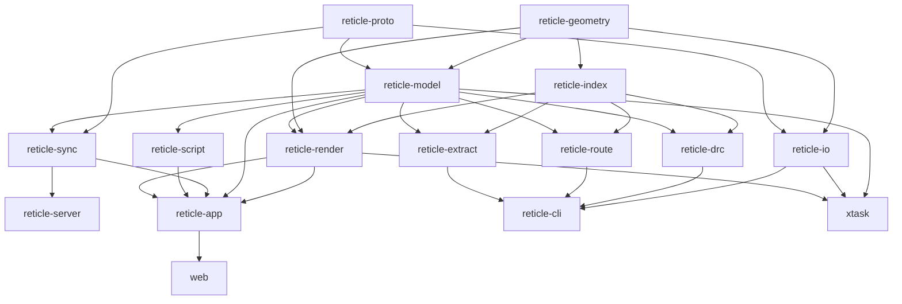

# Reticle architecture: crate dependency graph and build order

This is the dependency-ordered decomposition of the project into its workspace
crates and the order they build in. It is the companion to `docs/decisions/` (the
architecture decision records).

## Principles

- **Contract-first.** The contract tier freezes every cross-crate interface (the
  Protobuf schema and the shared Rust traits) up front, so a downstream crate never
  blocks on the internals of the crate it depends on.
- **Always green.** Every crate compiles at every integration point. The initial
  skeleton is std-only with stubbed bodies; each tier replaces stubs with real,
  tested implementations. `just ci` is the gate before every commit and at every
  integration point.
- **Use proven crates.** The hard subsystems (polygon booleans, R-tree, GDSII,
  wgpu, CRDT, routing, scripting) use the Appendix A crates rather than
  hand-rolled code. See `docs/decisions/`.
- **Measure, never fabricate.** Performance numbers are measured on the host
  (RTX 4060 Ti) and recorded in `PERF.md` with methodology.

## Crate graph

## Build order (dependency tiers)

The crates build in dependency order; a tier depends only on the tiers above it.

| Tier | Crates | Depends on |
|---|---|---|
| Contracts | `reticle-proto` schema + the shared `reticle-model` traits and value types | None |
| Foundation | `reticle-geometry`, `reticle-index`, `reticle-io` | Contracts |
| Engine | `reticle-model`, `reticle-render`, `reticle-drc`, `reticle-route`, `reticle-extract` | Foundation |
| Services | `reticle-sync`, `reticle-server`, `reticle-script`, `reticle-cli` | Engine |
| Product | `reticle-app`, `web`, `xtask` | Services |
| Docs and media | mdbook chapters, the fuzz corpus, the benchmark history, media capture, the release tooling | Product |

Dependency order is preserved throughout: geometry and proto precede render;
render and model precede app. The model trait and type surface is frozen by the
contract tier, so `render`/`drc`/`route`/`extract` compile against that frozen
contract while the model crate fills in its implementation.

## Definition of done

Audited before each release: every crate builds and `just ci` is green; the native
app and the browser demo run; every subsystem functions with tests; performance is
measured and recorded (`PERF.md`); the book and rustdoc are deployed; and a tagged
release exists with binaries and notes (`CHANGELOG.md`).
