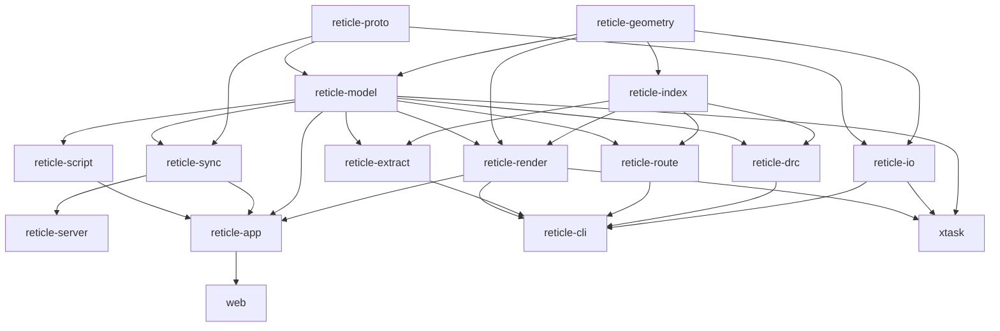

# Reticle build plan (task graph)

This is the dependency-ordered decomposition of the project specification into
waves and lanes. It is the canonical companion to `docs/TASKS.md` (the checklist)
and `docs/decisions/` (the architecture decision records).

## Principles

- **Contract-first.** Wave 0 freezes every cross-crate interface (the Protobuf
  schema and the shared Rust traits) so parallel lanes never block on each other.
- **Always green.** Every crate compiles at the end of every wave. The Wave 0
  skeleton is std-only with stubbed bodies; each later wave replaces stubs with
  real, tested implementations. `just ci` is the gate before every commit and at
  every wave merge.
- **Use proven crates.** The hard subsystems (polygon booleans, R-tree, GDSII,
  wgpu, CRDT, routing, scripting) use the Appendix A crates rather than
  hand-rolled code. See `docs/decisions/`.
- **Measure, never fabricate.** Performance numbers are measured on the host
  (RTX 4060 Ti) and recorded in `PERF.md` with methodology.

## Crate graph

## Waves and lanes

| Wave | Type | Lanes (crates) | Depends on |
|---|---|---|---|
| 0 | serial | contracts (proto schema + shared traits), workspace skeleton, licenses, justfile, skills, MCP servers, docs, `git init`, `cargo fetch`/`build` | — |
| 1 | parallel | `reticle-geometry`, `reticle-proto`, `reticle-index`, `reticle-io` | Wave 0 |
| 2 | parallel | `reticle-model`, `reticle-render`, `reticle-drc`, `reticle-route`, `reticle-extract` | Wave 1 |
| 3 | parallel | `reticle-sync`, `reticle-server`, `reticle-script`, `reticle-cli` | Wave 2 |
| 4 | parallel | `reticle-app`, `web`, `xtask` | Wave 3 |
| 5 | parallel | docs (mdbook), fuzz corpus, benchmark history, media capture, release | Wave 4 |

Dependency order preserved: geometry + proto (W1) precede render (W2); render +
model (W2) precede app (W4). Within Wave 2, `model` is co-located with its
consumers; this is safe because Wave 0 froze the model trait/type surface, so
render/drc/route/extract compile against the frozen contract while the model lane
fills in the implementation. The integration role reconciles any interface delta
at the W2 boundary.

## Development model

The build proceeds in waves. Within a wave, each crate is an independent
workstream ("lane") taken to completion — code, unit and property tests, fuzz
targets where relevant, benchmarks, rustdoc, and its book chapter — against the
interfaces frozen in Wave 0. Lanes are developed in isolated git worktrees and
integrated at each wave boundary, where the full `just ci` gate must pass and the
requirements-mapping table is brought up to date before the next wave begins.

## Definition of done

Tracked in `docs/TASKS.md` and audited before the v3.0.0 release: every crate
builds and `just ci` is green; the native app and browser demo run; every
subsystem functions with tests; performance is measured and recorded; the book and
rustdoc are deployed; and a tagged release exists with binaries and notes.
