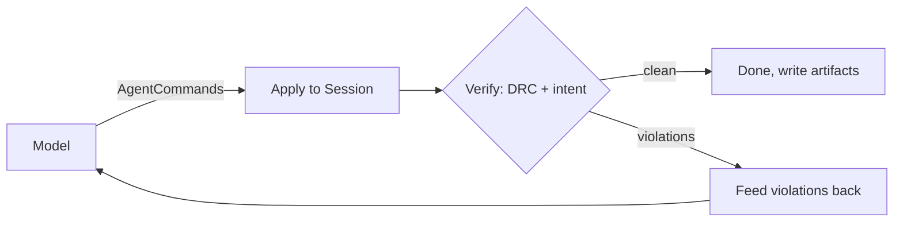

# Agent API and harness

Reticle exposes its whole editing engine as a small, serializable command surface,
so a program (or a language model) can build and check layouts through the same
operations a human uses. On top of that surface sits a propose-verify-correct
harness that drives a model against objective checks, writes a replayable
transcript, and can mirror its edits onto the live collaboration document.

## The command surface (`reticle-agent-api`)

[`AgentCommand`](https://docs.rs/reticle-agent-api) is a tagged, serde-serializable
enum of 25 operations over the engine: create a cell, add a rectangle, polygon, or
path, add a label or pin, transform or delete shapes, set the technology, run DRC,
check a connectivity intent, extract nets, compare against a netlist, export GDS or
OASIS, and render a region to PNG. A [`Session`] owns an editable document and a
stable element-id allocator, so a command that adds geometry returns an
[`ElementId`] that later commands and the transcript can refer to even across
deletions (ADR 0018).

Every command applied to a session is recorded as a [`CommandRecord`] in a
[`Transcript`], and the model's document has a [`document_hash`]. Replaying a
transcript reproduces that hash exactly, so a run is deterministic and auditable:
the `verify_replay` path recomputes the hash and rejects a tampered transcript.

## The propose-verify-correct loop (`reticle-agent`)

The harness asks a [`ModelClient`] for a batch of commands, applies them to a private
session, and verifies the result with the SKY130 DRC subset plus, where a task
carries an intent spec, the connectivity checker. Violations become correcting
context for the next proposal, up to an iteration bound. Success is defined by the
checker, not by the model's say-so, and a failure is recorded as a failure, never
retro-edited to a pass. Each run writes four artifacts: the transcript, the final
GDS, a rendered PNG, and a result record.

The model is either the real `AnthropicModel` (an Anthropic-compatible endpoint; the
API key is read from the environment only and never printed, serialized, or written
to an artifact) or the deterministic `MockModel` used offline and in tests.

## Live collaboration (`reticle-agent::collab`)

An [`AgentCollaborator`] mirrors each agent step onto the `reticle-sync` CRDT under a
distinct actor id, as one atomic transaction per step, so a human peer watching the
room never sees a half-drawn step and can edit alongside the agent (ADR 0022). The
same transcript the harness writes is what the in-app replay theater plays back
through a live session.

## Scoped sessions and context packs (`reticle-agent::context_pack`)

A session can be opened on a *region* of the document rather than the whole thing. This
is what the DRC error browser's "ask the agent to fix this" button does: it hands the
harness a rectangle and the specific violation, and the agent works only that corner.

For a scoped run the harness does not condition the model on the whole-document
snapshot. Instead a [`ContextPack`] assembles a minimal, region-local context string:

1. the scoped region;
2. the shapes whose bounding box overlaps that region, each as kind, layer, and
   bounding box, capped so a dense region still yields a bounded prompt;
3. the violated rule, stated structurally (kind, layers, measured value, required
   value);
4. only the technology rules whose layers appear in those shapes or in the violation.

The overlap test is the same inclusive touch-or-overlap test the `query_shapes` command
uses, so a pack and a `query_shapes` on the same rectangle agree on which shapes are in
scope. The pack is a pure function of the document and the region, so it plugs into the
same context hook the whole-document path uses: a scoped run sets the model's document
context to the pack instead of the summary.

**Why it saves tokens.** The compact per-cell summary the unscoped hook sends is already
small, but it is lossy: it lists how many shapes a cell holds, not where they are. To
reason about a local geometric fix a model needs the coordinates of the nearby shapes,
so the honest whole-document baseline is the full per-shape listing (`whole_document_context`),
not the summary. A pack replaces that full listing with a region-scoped slice.

On a synthetic document of one cell with 200 shapes, a met1 width rule and a met2
spacing rule, and a repair region overlapping exactly one shape, the measured estimates
(characters over four) are:

| Context | Tokens | Characters |
| --- | --- | --- |
| Whole-document, full per-shape fidelity | 1878 | 7509 |
| Scoped pack (one shape + violation + one relevant rule) | 62 | 245 |

That is roughly a 30x reduction, about 97% fewer tokens, and the pack's size tracks the
*region* rather than the design, so the saving grows with the design. The measurement is
pinned by a test in the `context_pack` module.

## Where it runs

- `reticle-mcp` exposes this command surface to a model over the Model Context
  Protocol; see [the MCP chapter](mcp.md).
- `reticle-demo-server` runs the loop behind a rate-limited public endpoint and
  streams each step to a watchable room; see [Deployment](deployment.md).
- The [benchmark suite](benchmarks.md) scores the loop across 63 graded tasks.

See ADRs [0018](https://github.com/AlpharomeroJL/reticle/blob/main/docs/decisions/0018-agent-api-layering-and-element-ids.md),
[0021](https://github.com/AlpharomeroJL/reticle/blob/main/docs/decisions/0021-intent-types-in-extract.md),
and [0022](https://github.com/AlpharomeroJL/reticle/blob/main/docs/decisions/0022-agent-crdt-collaborator-bridge.md).
