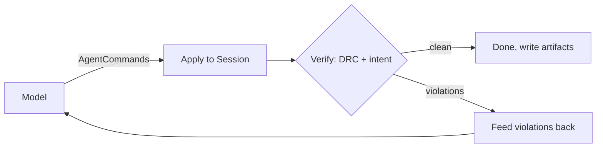

# Agent API and harness

Reticle exposes its whole editing engine as a small, serializable command surface,
so a program (or a language model) can build and check layouts through the same
operations a human uses. On top of that surface sits a propose-verify-correct
harness that drives a model against objective checks, writes a replayable
transcript, and can mirror its edits onto the live collaboration document.

## The command surface (`reticle-agent-api`)

[`AgentCommand`](https://docs.rs/reticle-agent-api) is a tagged, serde-serializable
enum of 25 operations over the engine: create a cell, add a rectangle, polygon, or
path, add a label or pin, transform or delete shapes, set the technology, run DRC,
check a connectivity intent, extract nets, compare against a netlist, export GDS or
OASIS, and render a region to PNG. A [`Session`] owns an editable document and a
stable element-id allocator, so a command that adds geometry returns an
[`ElementId`] that later commands and the transcript can refer to even across
deletions (ADR 0018).

Every command applied to a session is recorded as a [`CommandRecord`] in a
[`Transcript`], and the model's document has a [`document_hash`]. Replaying a
transcript reproduces that hash exactly, so a run is deterministic and auditable:
the `verify_replay` path recomputes the hash and rejects a tampered transcript.

## The propose-verify-correct loop (`reticle-agent`)

The harness asks a [`ModelClient`] for a batch of commands, applies them to a private
session, and verifies the result with the SKY130 DRC subset plus, where a task
carries an intent spec, the connectivity checker. Violations become correcting
context for the next proposal, up to an iteration bound. Success is defined by the
checker, not by the model's say-so, and a failure is recorded as a failure, never
retro-edited to a pass. Each run writes four artifacts: the transcript, the final
GDS, a rendered PNG, and a result record.

The model is either the real `AnthropicModel` (an Anthropic-compatible endpoint; the
API key is read from the environment only and never printed, serialized, or written
to an artifact) or the deterministic `MockModel` used offline and in tests.

## Planning transparency (`PlanStep`)

Before each iteration's proposal, the harness records a `PlanStep`: the iteration's
goal (the task prompt), the intended tools (the `op` names of the commands the model
proposed, in order), and the expected checks (the always-on DRC oracle plus the
task's own checker). These steps accumulate into `Transcript::plan`, a parallel log
that rides alongside the command records, and the agent panel renders them as a
Plan section so a viewer can see the agent's stated intent next to what it did.

A plan step is narration, not a contract: nothing enforces that an iteration used
exactly the tools it listed or that its checks passed. That is deliberate, so the
stated plan and the recorded outcome can be compared after the fact for failure
mining. The field is additive and replay-neutral: it carries `#[serde(default)]`, so
a transcript written before the plan log existed still deserializes (as an empty
plan), and replay reads only the records and the final hash.

## Live collaboration (`reticle-agent::collab`)

An [`AgentCollaborator`] mirrors each agent step onto the `reticle-sync` CRDT under a
distinct actor id, as one atomic transaction per step, so a human peer watching the
room never sees a half-drawn step and can edit alongside the agent (ADR 0022). The
same transcript the harness writes is what the in-app replay theater plays back
through a live session.

## Where it runs

- `reticle-mcp` exposes this command surface to a model over the Model Context
  Protocol; see [the MCP chapter](mcp.md).
- `reticle-demo-server` runs the loop behind a rate-limited public endpoint and
  streams each step to a watchable room; see [Deployment](deployment.md).
- The [benchmark suite](benchmarks.md) scores the loop across 63 graded tasks.

See ADRs [0018](https://github.com/AlpharomeroJL/reticle/blob/main/docs/decisions/0018-agent-api-layering-and-element-ids.md),
[0021](https://github.com/AlpharomeroJL/reticle/blob/main/docs/decisions/0021-intent-types-in-extract.md),
and [0022](https://github.com/AlpharomeroJL/reticle/blob/main/docs/decisions/0022-agent-crdt-collaborator-bridge.md).
