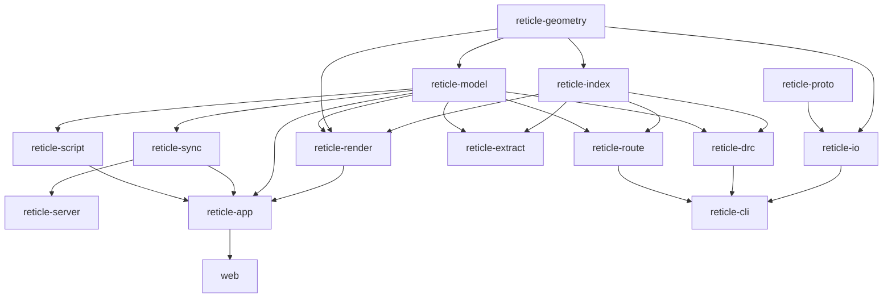

# Architecture

Reticle is a Cargo workspace of focused crates. The core geometry, indexing, and
model crates are deliberately free of GPU, async, and UI code so they stay fast to
test and clean to read; the heavier subsystems build on top of them.

## Crate graph

## Responsibilities

| Crate | Responsibility |
|---|---|
| `reticle-geometry` | Exact integer primitives and robust polygon booleans, offsetting, winding, and convex decomposition. |
| `reticle-index` | Bulk-loaded R-tree, uniform grid, and a tile/LOD pyramid for out-of-core browsing. |
| `reticle-model` | The hierarchical document: cells, instances, arrays, transforms, bbox caching, flattening, and a transactional edit history. |
| `reticle-proto` | The versioned Protobuf schema and generated types for the document, wire, and collaboration formats. |
| `reticle-io` | GDSII and OASIS import and export, plus a technology-file parser. |
| `reticle-render` | The `wgpu` renderer: instanced pipelines, GPU-driven culling, tiles, LOD, overlays. |
| `reticle-drc` | A declarative, incremental design-rule checker. |
| `reticle-route` | A grid and maze router with rip-up and reroute. |
| `reticle-extract` | Geometric connectivity extraction across contacts and vias. |
| `reticle-sync` | Real-time collaboration over a `yrs` CRDT, with presence and comments. |
| `reticle-server` | The WebSocket collaboration relay. |
| `reticle-script` | An embedded `rhai` scripting API over the model. |
| `reticle-app` | The interactive `egui` application, native and in the browser. |
| `reticle-cli` | The headless import, DRC, route, extract, export, and render pipeline. |
| `web` | The WebAssembly harness with a WebGPU capability check and WebGL2 fallback. |

## Design principles

- **Exact integers.** Coordinates are database units (DBU), never floating point;
  see the [Geometry](geometry.md) chapter and ADR 0002.
- **Contract-first.** The cross-crate types and traits are frozen before the
  subsystems that depend on them are written, so a change to a shared interface is
  a deliberate, reviewed event.
- **Proven crates for hard problems.** Polygon booleans (`i_overlay`), the R-tree
  (`rstar`), GDSII (`gds21`), rendering (`wgpu`), the CRDT (`yrs`), and routing
  primitives (`pathfinding`) are delegated to mature libraries; Reticle owns the
  domain logic that ties them together. The architecture decision records under
  `docs/decisions/` explain each choice.
- **Measure, never guess.** Performance targets are backed by benchmarks run on
  real hardware; see the [Performance methodology](performance.md).

## The local build gate

There is no hosted CI. A single `just ci` recipe runs formatting, Clippy with
warnings denied, the test suite, a documentation build, a WebAssembly build,
license and advisory checks, and a spell check. It must be green before every
commit. See [Contributing](contributing.md).
