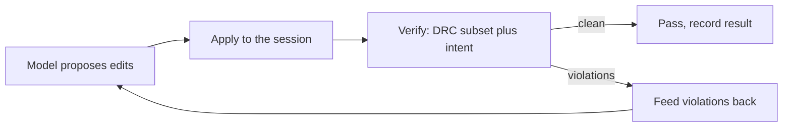

# Agent benchmark suite

The benchmark suite measures whether a model, driven through the Reticle agent API,
can turn a natural-language layout instruction into geometry that passes an
objective check. It is a fixed, versioned set of tasks with machine-graded
checkers, so a run produces a comparable, reproducible score rather than a vibe.

## What a task is

Each task is a TOML file under `benchmarks/layout-tasks/` naming a prompt, the
technology, and a checker with its parameters. The checker is the oracle: it
accepts a correct document and rejects a broken one. Every checker is **two-way
tested**, so a task cannot pass by luck or by a checker that always returns true;
the test proves the checker accepts the intended solution and rejects a
deliberately perturbed one.

The suite (`manifest.toml`, version 0.3.0) has **63 tasks across five tiers**:

| Tier | Focus | Examples |
| ---- | ----- | -------- |
| 1 | Primitive placement and legality | place a met1 rectangle, clear the min width and min area rules |
| 2 | Structured geometry | contact stacks, via chains, comb structures |
| 3 | Larger structured geometry and connectivity intent | guard rings, multi-net intent |
| 4 | Compound cells | cells composed of several checked features |
| 5 | Real SKY130 PDK | named periphery rules (m1.1, m1.4, m2.4, li.5, ct.1, licon.1, via.1a) and the measured geometry of the `sky130_fd_sc_hd` tap and fill cells |

## The propose-verify-correct loop

A run drives each task through the same loop the `reticle-agent` harness uses:



The verifier is the SKY130 DRC subset plus, where a task carries an intent spec,
the connectivity checker. Violations are fed back as correcting context for the
next proposal, up to an iteration bound. The result of each task is recorded as a
JSON record (`task_id`, `model`, `success`, `iterations`, first and final
violation counts, wall time) and rolled up into a Markdown summary.

## Running it

```
just bench-agent                     # the whole suite
just bench-agent --tier 5            # one tier
just bench-agent --task t1_place_met1_rect
```

The model is chosen by the environment. The deterministic `MockModel` is the
offline default and needs no key or network; the real `AnthropicModel` (in
`reticle-agent`) runs the same tasks against a live model when `ANTHROPIC_API_KEY`
is set. Every result record carries the `model` field so mock and live runs are
never conflated.

## Current result: the mock machinery baseline

The run below used the **deterministic `MockModel`** (no `ANTHROPIC_API_KEY` was
set). It exercises the whole pipeline end to end for all 63 tasks: every task
loads, runs through the loop, is graded by its two-way-tested checker, and is
recorded.

| Tier | Tasks | Passed | Success rate | Mean iterations |
| ---- | ----- | ------ | ------------ | --------------- |
| 1 | 9 | 3 | 33% | 1.22 |
| 2 | 11 | 0 | 0% | 1.00 |
| 3 | 25 | 0 | 0% | 1.00 |
| 4 | 8 | 0 | 0% | 1.00 |
| 5 | 10 | 0 | 0% | 1.00 |
| all | 63 | 3 | 5% | 1.03 |

This is a **machinery baseline, not a measure of a language model's layout
ability.** The `MockModel` is scripted to solve only the three sample tasks
(`t1_place_met1_rect`, `t1_drc_clean_met1`, `t1_intent_connect`) that exist to
prove the harness end to end; it has no scripted solution for the other 60
authored tasks, so it fails them by construction. A real model run (with a key)
is what produces a meaningful success rate across the authored tasks; those
numbers will be recorded here, labeled with the model id, when a keyed run is
performed. Publishing the 5% mock figure as if it were a model score would be
dishonest, so it is labeled as what it is: proof that all 63 tasks and their
checkers run.

## Growing the suite

Failure mining (`reticle-bench`'s `mining` module) turns real run failures into
candidate tasks with provenance and two-way vectors; `just bench-promote <id>`
admits a candidate into the live suite only if its checker passes those vectors,
and bumps the manifest version. So the suite grows from observed failures without
ever admitting a checker that cannot both accept and reject.
