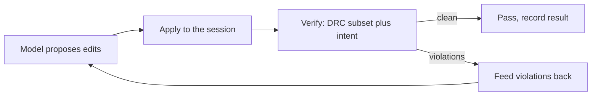

# Agent benchmark suite

The benchmark suite measures whether a model, driven through the Reticle agent API,
can turn a natural-language layout instruction into geometry that passes an
objective check. It is a fixed, versioned set of tasks with machine-graded
checkers, so a run produces a comparable, reproducible score rather than a vibe.

## What a task is

Each task is a TOML file under `benchmarks/layout-tasks/` naming a prompt, the
technology, and a checker with its parameters. The checker is the oracle: it
accepts a correct document and rejects a broken one. Every checker is **two-way
tested**, so a task cannot pass by luck or by a checker that always returns true;
the test proves the checker accepts the intended solution and rejects a
deliberately perturbed one.

The suite (`manifest.toml`, version 0.4.0) has **75 tasks across five tiers**:

| Tier | Focus | Examples |
| ---- | ----- | -------- |
| 1 | Primitive placement and legality | place a met1 rectangle, clear the min width and min area rules |
| 2 | Structured geometry | contact stacks, via chains, comb structures |
| 3 | Larger structured geometry, connectivity intent, and Wave-3 tool ops | guard rings, multi-net intent, boolean unions/intersections/differences, arrays with pitch, via stacks |
| 4 | Compound cells and iterative refinement | cells composed of several checked features, tasks with a scripted follow-up constraint |
| 5 | Real SKY130 PDK | named periphery rules (m1.1, m1.4, m2.4, li.5, ct.1, licon.1, via.1a) and the measured geometry of the `sky130_fd_sc_hd` tap and fill cells |

### Wave-3 task families (v0.4.0)

Version 0.4.0 adds 12 tasks that exercise the Wave-3 command surface
(`boolean_combine`, `align_shapes`, `distribute_shapes`, `offset_shapes`,
`build_via_stack`):

- **Boolean-op constructions** (3, tier 3): union, intersection, and difference of
  the same two overlapping met1 squares. The `boolean_result` checker pins which op
  ran by the result area written to met2 (150000 vs 30000 vs 60000 DBU²) and requires
  the met1 inputs to be consumed, so "drew the wrong op" or "left the inputs behind"
  both fail.
- **Array-with-pitch** (3, tier 3): a row, a column, and a grid placed at a stated
  pitch. The `array_pitch` checker verifies both the instance count and the actual
  column/row step, so an array at the wrong pitch is rejected even with the right
  count.
- **Via-stack** (3, tier 3): a `build_via_stack` cut bridging met1/met2, li1/met1,
  and poly/li1. The `contact_stack` checker verifies the stack joins both conductors
  on one net and each encloses the cut by a minimum margin.
- **Iterative-refinement** (3, tier 4): an initial prompt plus a scripted
  `refinement` follow-up ("make it larger", "add a second shape"). The refinement-aware
  runner folds the follow-up into the model's feedback *between* iterations through the
  `reticle-agent` refinement seam (`RefinementSource` / `run_agent_task_refined`), so
  the model reacts on the next proposal without the session being restarted; the
  checker enforces the tightened, post-refinement bar.

The `refinement` field is additive on `BenchTask` (`#[serde(default)]`), so task TOML
written before it existed still parses unchanged.

## The propose-verify-correct loop

A run drives each task through the same loop the `reticle-agent` harness uses:



The verifier is the SKY130 DRC subset plus, where a task carries an intent spec,
the connectivity checker. Violations are fed back as correcting context for the
next proposal, up to an iteration bound. The result of each task is recorded as a
JSON record (`task_id`, `model`, `success`, `iterations`, first and final
violation counts, wall time) and rolled up into a Markdown summary.

## Running it

```
just bench-agent                     # the whole suite
just bench-agent --tier 5            # one tier
just bench-agent --task t1_place_met1_rect
```

The model is chosen by the environment. The deterministic `MockModel` is the
offline default and needs no key or network; the real `AnthropicModel` (in
`reticle-agent`) runs the same tasks against a live model when `ANTHROPIC_API_KEY`
is set. Every result record carries the `model` field so mock and live runs are
never conflated.

## Current results: two local models

The runs below drove two local models through the whole 75-task suite over Ollama on
the host, each task graded by its two-way-tested checker. The raw per-task
`ResultRecord` files and their command transcripts are committed under
[`benchmarks/results/`](https://github.com/AlpharomeroJL/reticle/tree/main/benchmarks/results);
the rows here are computed from those records.

| Model | Quantization | Tier 1 | Tier 2 | Tier 3 | Tier 4 | Tier 5 | Overall |
|---|---|---:|---:|---:|---:|---:|---:|
| `gpt-oss:16k` (20B) | MXFP4 | 9/9 | 11/11 | 19/34 | 5/11 | 8/10 | **52/75 (69%)** |
| `qwen2.5-coder:16k` (14B) | Q4_K_M | 6/9 | 8/11 | 6/34 | 3/11 | 6/10 | **29/75 (39%)** |

These are small quantized local models, so the numbers are a realistic floor, not a
ceiling. The gap has a concrete cause: `gpt-oss:16k` returns native tool calls, while
`qwen2.5-coder:16k` often ignores the forced tool choice and embeds the call in message
text, which a text fallback recovers less reliably. Both paths are handled and
regression-tested. Local model outputs are not deterministic between runs; the
transcript-replay determinism (replaying a recorded transcript to a fixed
`document_hash`) is unaffected and is a committed test.

The deterministic `MockModel` (no key, no network) solves only the three sample tasks
(`t1_place_met1_rect`, `t1_drc_clean_met1`, `t1_intent_connect`) that prove the harness
end to end; `just bench-agent` runs it and reports 3/75, a machinery baseline that shows
all 75 tasks and their checkers execute, not a model score.

## Growing the suite

Failure mining (`reticle-bench`'s `mining` module) turns real run failures into
candidate tasks with provenance and two-way vectors; `just bench-promote <id>`
admits a candidate into the live suite only if its checker passes those vectors,
and bumps the manifest version. So the suite grows from observed failures without
ever admitting a checker that cannot both accept and reject.

The miner clusters failed and struggling runs by a failure **signature**, so a
recurring failure mode becomes one candidate rather than many near-duplicates. A
signature has four dimensions:

- the persistent DRC rule ids no correction attempt ever cleared;
- a geometric-pattern class (rectangles, a layer stack, a polygon, a path, a
  placement, or no geometry at all);
- the connectivity-intent kind the run ended with (an open, a short, both, or
  none);
- the **tool surface**: which of the Wave 3 editing commands the run
  reached for.

### Tool-surface failure mining

The Wave 3 tool surface is the higher-level editing commands added to the agent
API after the first tasks were authored: `boolean_combine`, `align_shapes`,
`distribute_shapes`, `offset_shapes`, and `build_via_stack`. A model can fail a
task *through* one of these tools (a botched boolean merge, a via stack whose
enclosure violates the rule) in a way that looks identical, by DRC rule and
geometric pattern, to a failure drawn shape by shape. Clustering by tool surface
splits those apart, so the miner surfaces a tool-specific cluster (and drafts a
candidate whose id and prompt name the tool) instead of hiding the tool failure
inside a generic geometry cluster. The tool surface is recorded whether or not
the command succeeded: a command the model *tried* is evidence of intent to use
that tool. Every drafted candidate carries its tool surface in its provenance,
alongside the backend, model, and quantization of each source run, so a failure
mined from a local (Ollama) run is never conflated with a mock or frontier one.

The tool surface is read from a run's command **transcript**. The committed
local-model sets under `benchmarks/results/` include each task's transcript
alongside its result record, so mining them recovers the full DRC, geometric,
intent, and tool-surface signature, not just the backend provenance.
