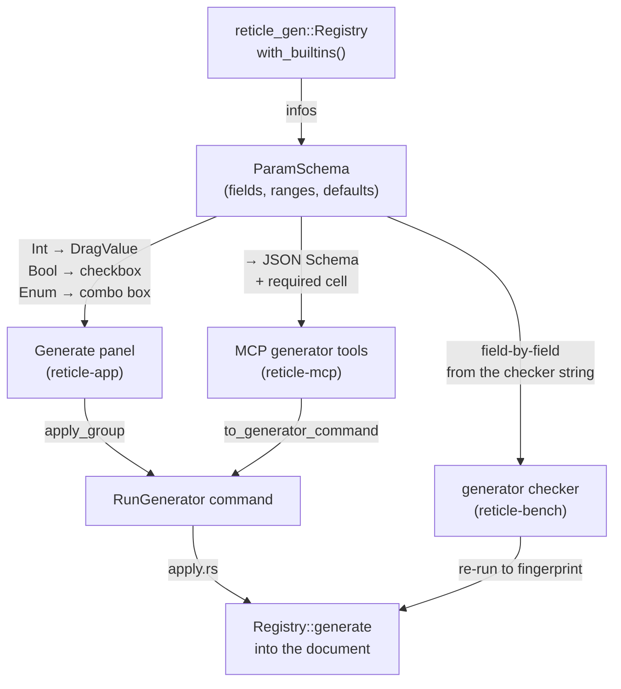

# Layout generators

A generator turns a few numbers into the repetitive structure a layout engineer would
otherwise draw by hand: a guard ring, a via farm, a pad ring, a seal ring, a density
fill, or a probe-able test structure. Each one is a pure function from typed
parameters plus a technology to geometry, and every generator is
[DRC-clean by construction](sky130-drc-coverage.md) against the SKY130 subset (see
[ADR 0043](https://github.com/AlpharomeroJL/reticle/blob/main/docs/decisions/0043-generators-drc-clean-by-construction.md)).
The generator framework itself, the typed [`Generator`](https://docs.rs/reticle-gen)
trait and the type-erased [`Registry`](https://docs.rs/reticle-gen) that drives it by
id, is described in
[ADR 0042](https://github.com/AlpharomeroJL/reticle/blob/main/docs/decisions/0042-generator-trait-typed-and-erased.md).

This chapter is about the three product surfaces that expose those generators: the
Generate panel in the app, the generator tools on the agent and MCP surface, and the
generator tasks in the benchmark. All three drive the *same* registry from one
machine-readable schema, so a generator is described once and surfaces everywhere.

## One schema, three surfaces

Every generator publishes a `ParamSchema`: its field names, their types (a bounded
`Int`, a `Bool`, or an `Enum` of string variants), per-field ranges, defaults, and
one-line docs. That schema is plain serde data with no behaviour, so each surface
renders it its own way from the same source.

The one command underneath all of this is `RunGenerator { cell, generator_id, params }`,
the additive Wave 2D amendment to the frozen agent command surface
([ADR 0048](https://github.com/AlpharomeroJL/reticle/blob/main/docs/decisions/0048-wave2d-run-generator-command.md)).
Its apply arm generates into a scratch cell, then commits each produced shape as a
normal edit, so a generator run is transcript-replayable and undoable exactly like a
hand-drawn shape.

## The Generate panel

The panel ([`generate_panel`](https://docs.rs/reticle-app),
[ADR 0050](https://github.com/AlpharomeroJL/reticle/blob/main/docs/decisions/0050-generate-panel-schema-form-and-preview.md))
lists the generators from the registry and, for the selected one, builds a typed form
straight from its schema: an `Int` field is a drag control clamped to its `[min, max]`,
a `Bool` is a checkbox, an `Enum` is a combo box over the variants. The form is seeded
from the generator's defaults, so the panel opens on a working example that generates
unchanged.

As the parameters change, the panel generates them into a scratch cell and draws the
resulting geometry as a **live preview** overlay on the canvas, in a distinct accent,
so you see the structure before committing it. A parameter that is momentarily out of
range simply shows no overlay and surfaces the generator's own message (which names the
offending field) as text below the form, rather than flickering an error on the canvas.

Pressing Generate places the whole structure into the document as one undo-integrated
edit: the produced shapes are applied together through `History::apply_group`, so a
single Undo removes the entire generated structure. Because `reticle-gen` is pure
geometry that compiles for `wasm32-unknown-unknown`, the panel and its live preview work
in the browser too.

## Generator tools for the agent and MCP

On the MCP surface ([`generators`](https://docs.rs/reticle-mcp),
[ADR 0049](https://github.com/AlpharomeroJL/reticle/blob/main/docs/decisions/0049-mcp-generator-tools.md))
each generator is advertised as its own tool, named for the generator id
(`guard_ring`, `via_farm`, `pad_ring`, `seal_ring`, `fill`, `test_structure`). The
tool's input schema is the generator's `ParamSchema` converted to a tight model-facing
JSON Schema: an `Int` becomes an `integer` with inclusive `minimum`/`maximum` and a
`default`, a `Bool` a `boolean`, an `Enum` a `string` constrained by `enum`. A required
`cell` field is prepended (the target is not one of the generator's parameters). A tool
call maps to a `RunGenerator` command by splitting the `cell` out and folding the rest
into the parameter object; the generator validates the parameters itself, so a bad value
is a well-formed `invalid_argument` tool error.

Because the catalog is derived from the registry's `infos()`, adding a seventh generator
surfaces a seventh tool automatically, with no `reticle-mcp` change.

## Generator benchmark tasks

The [benchmark](benchmarks.md) poses generator constructions in natural language ("place
a guard ring around the selected cell", "drop a 4 by 4 via farm", "fill this region with
decap at 60 percent density", "add a van der Pauw test structure") and grades them with a
`generator` checker. Rather than hand-code the expected geometry per structure, the
checker re-runs the named generator with the task's parameters to build a per-layer
shape-count fingerprint, and requires the graded document to carry at least that many
shapes on each of those layers *and* be DRC-clean under the SKY130 subset. Because the
generators are DRC-clean by construction, a model that reproduced the structure lands the
same fingerprint; extra shapes never make the check fail, and a structurally-complete but
DRC-dirty answer fails on the cleanliness half.

The v0.5.0 suite adds 8 such tasks spread across all six generators, taking the suite
from 75 to 83 graded tasks.
