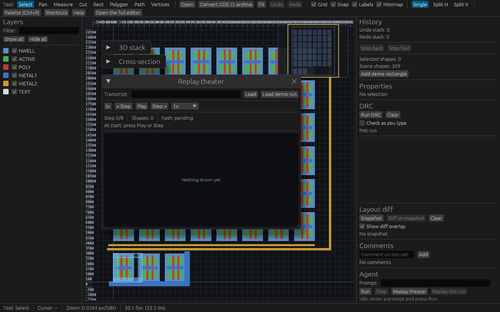
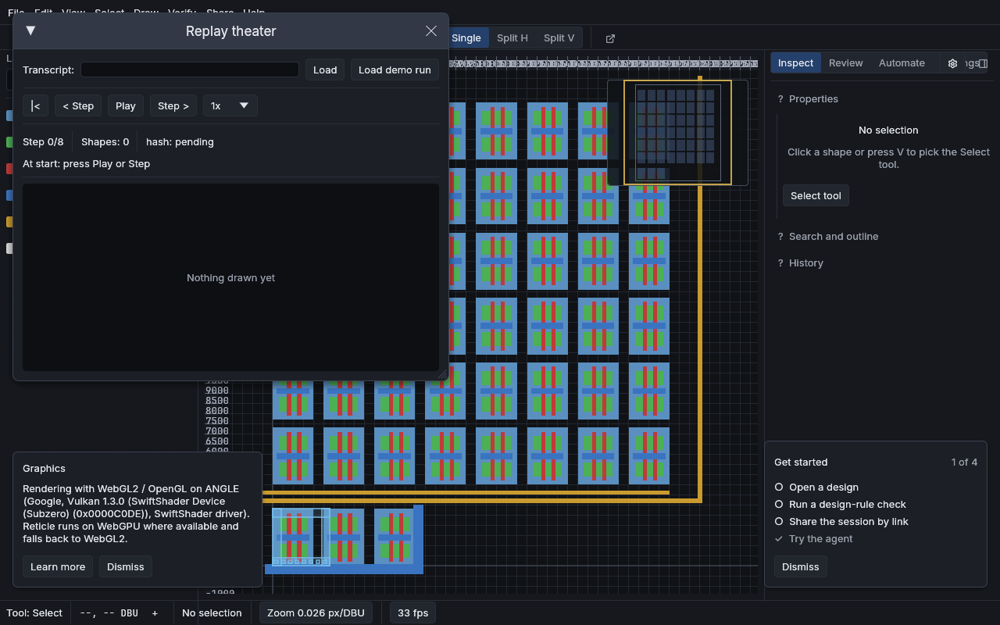
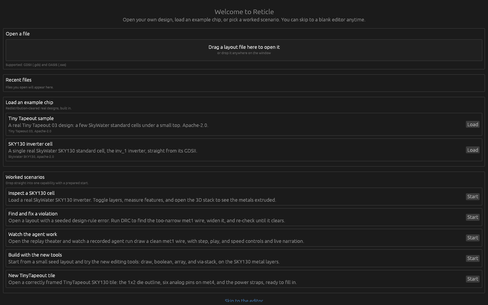
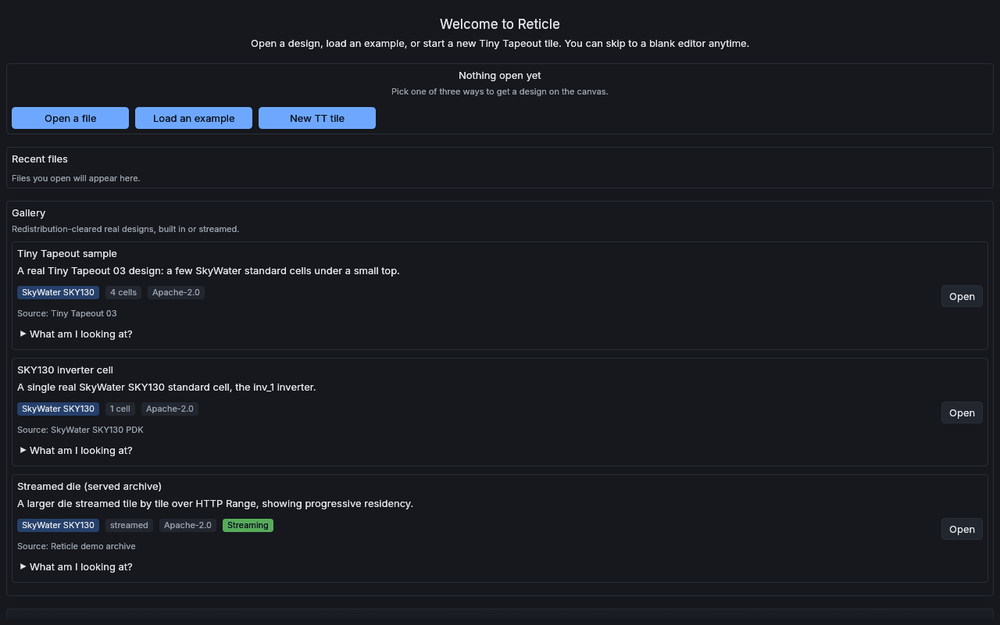
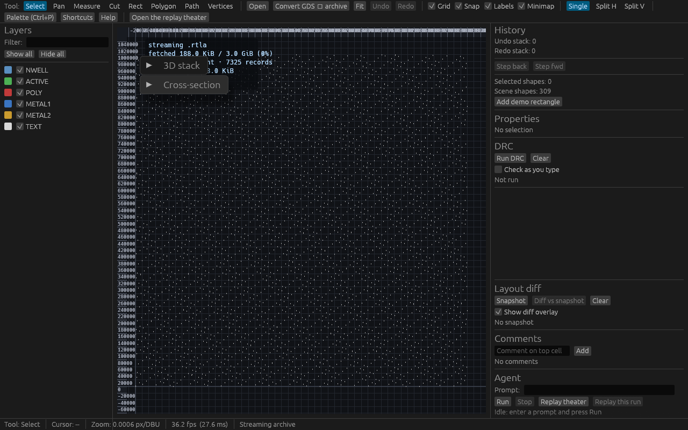
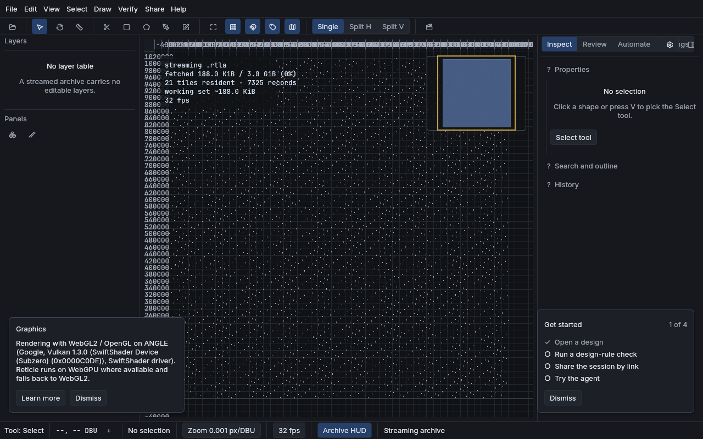
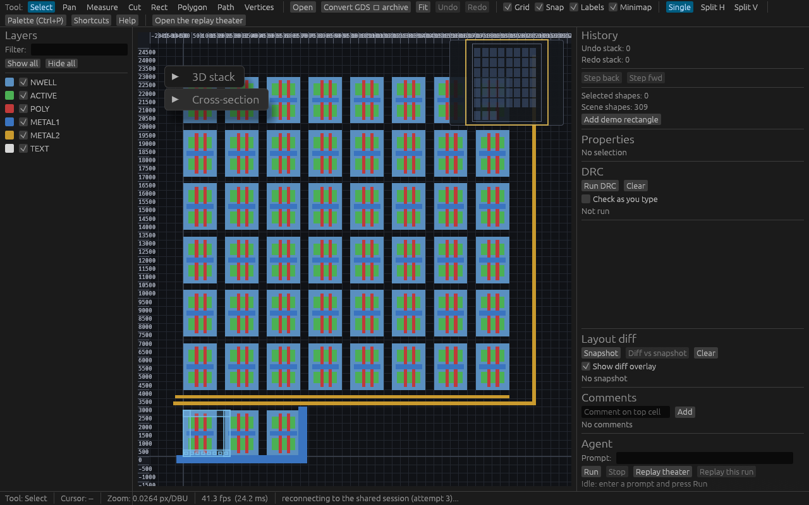
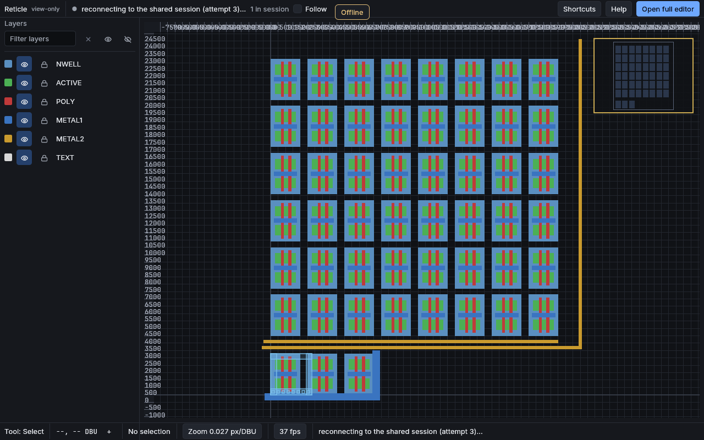

# The redesign: before and after

The v8.1 interface packet rebuilt the chrome around the same engine. This page
pairs the v8.0.0 interface (before) with the v8.1.0 interface (after) on the four
URL-reachable states, with a short note on what changed and which audit findings
and catalog items each pairing closes.

Method and provenance. The before set was captured from the deployed v8.0.0
bundle (`web-cc73d6608fe18660`) by `e2e/baseline-gallery.mjs` and lives under
`docs/design/baseline/` with a `manifest.md` recording exact provenance; a git
commit does not expire, so the before state is reproducible from the tag. The
after set uses the same filenames under `docs/design/after/` and is captured by
the Wave 5 gallery step; where an after image is not yet committed when you read
this, its path is the same name in `after/`. The full findings list is in
`docs/design/audit.md` (25 findings, AUD-01 to AUD-25); the per-item sweep is in
`docs/design/catalog-dispositions.md`.

Each pairing below shows the 1280x800 shot; the 1600x1000 and 900x600 variants
(and the phone and tablet variants for the before set) sit beside them in the two
directories.

## Landing view (home-default)

Before:

After:

The before landing put the replay theater window, the collapsed 3D stack, and the
Cross-section bar over the canvas at fixed positions (AUD-01), behind a single
wrapped toolbar of roughly 25 ungrouped controls with no menu bar, no icons, and
no shortcut hints (AUD-05), with "Add demo rectangle" as the first panel button
(AUD-09) and a smear of overlapping ruler labels at the origin (AUD-08). The after
landing has a registry-driven menu bar above a grouped, icon-and-tooltip toolbar
(catalog 25, 70), the 3D stack and Cross-section as managed bottom panels that
never occlude the canvas (ADR 0096), and an overlay layout manager that keeps the
minimap and rulers collision-free by construction (catalog 30, 31, 32, 68).

## Editor entry and Start screen (view-editor)

Before:

After:

The before Start surface was a column of undifferentiated gray strips with small
right-aligned buttons, no thumbnails, and no technology, size, or license badges,
and its "Skip to the editor" link clipped off the bottom at 1280x800 (AUD-11). The
after Start screen is rebuilt on the component library with an empty-canvas hero of
exactly three primary actions (catalog 16), differentiated gallery cards carrying
name, technology, size, source, and license badges plus a per-card landmarks
dropdown that answers "what am I looking at" (catalog 14, 96), pinnable recent
files (catalog 9, in part), and a skip link inside the scroll.

## Streaming an archive (archive-stream)

Before:

After:

Streaming the multi-gigabyte live archive over HTTP Range, the before view let the
collapsed floating windows cover the streaming HUD, so the flagship demo hid its
own proof-of-streaming (AUD-02), and the Layers panel and History still showed the
built-in demo document's layers and shape count while an unrelated die streamed
(AUD-04). The after view routes the HUD and the minimap through the overlay manager
so they stay legible, shades resident tiles on the minimap and uses the streamed
die bounds rather than the stale demo (catalog 30), adds velocity-aware tile
prefetch with an honest HUD line (catalog 43), and shows an empty-state in the
Layers panel because an archive carries no layer table.

## Share-link viewer (viewer-empty-room)

Before:

After:

The before share-link viewer was the full editor in disguise: History with a debug
button, DRC, Layout diff, Comments, Agent, and the draw tools, with the
share and follow controls below the fold of the right-panel scroll (AUD-03), and
the reconnect state was a line of tiny status-bar text (AUD-14). The after viewer
is a distinct chrome selected structurally by `is_viewer()`, not the editor with
panels hidden: canvas, status bar, Layers, presence cursors, a live session chip
with state and participant count and avatars (catalog 75), a follow toggle
(catalog 87), and one fixed "Open full editor" affordance (catalog 23), with
reconnect surfaced as a real toast and offline badge (catalog 74).

## Notes

- These four states are the URL-reachable ones a first visit or a share link can
  land on. Interior states that need in-app interaction (panels expanded, DRC and
  diff overlays, comments, the agent panel, the 3D stack, the cross-section) are
  captured by the native demo-script harness, not by the gallery script.
- The images render inline when the page is viewed against the repository tree
  (the paths are relative to `docs/design/`); the full before and after PNG sets,
  at every captured resolution, and the before-set provenance manifest live under
  `docs/design/baseline/` and `docs/design/after/`.
