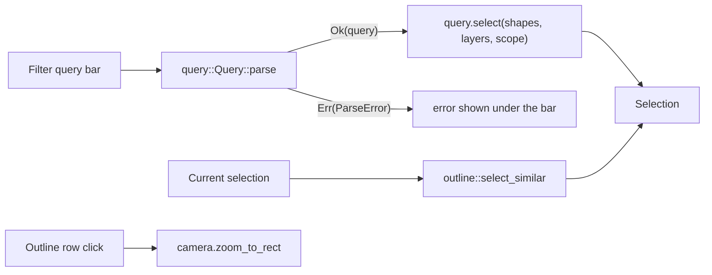

# Search and selection depth

The search panel adds three ways to build and navigate a selection that go beyond
clicking shapes one at a time: a filter query bar, saved selection sets with
select-similar, and a cell/instance outline that jumps the camera to whatever you
click. It sits at the bottom of the right-hand side panel, under the snapping panel.

Like the rest of the editor, the interesting parts are window-free and unit-tested.
The filter language lives in the `query` module (parser plus evaluator) and the
saved-set, select-similar, and outline logic in the `outline` module; the panel
itself is thin glue that binds widgets to that logic, unions the results into the
live selection, and defers the camera locate to the next canvas pass.



## The filter query language

The query bar takes a space-separated list of predicates that are combined with a
logical and: a shape is selected only when it satisfies every predicate. So

```text
layer:METAL1 width<400 area>1000
```

selects every shape on the `METAL1` layer that is narrower than 400 DBU and whose
bounding-box area exceeds 1000 DBU². The grammar is deliberately small:

```text
query      := predicate (WS predicate)*
predicate  := layer-pred | cell-pred | metric-pred
layer-pred := "layer:" NAME
cell-pred  := "cell:" NAME
metric-pred:= metric OP INT
metric     := "area" | "width" | "height"
OP         := "<" | "<=" | ">" | ">=" | "=" | "=="
```

Names match case-insensitively, so `layer:metal1` and `layer:METAL1` are the same.
The metric comparisons read straight off the shape's bounding box using the same
`i64` arithmetic as the geometry crate, so nothing is rounded: `area` is in DBU²,
`width` and `height` are in DBU.

`layer:` resolves the name against the current layer table; a name that is not in
the table simply matches nothing rather than erroring, so a typo narrows the
selection to empty instead of selecting the whole scene.

`cell:` is a scope assertion. The panel selects over the flattened top cell, so
individual shapes carry no cell provenance to filter on; `cell:TOP` therefore keeps
every shape while `TOP` is the cell being viewed and drops them all otherwise. It
lets a query state which cell it targets and read naturally next to the other
predicates, but it does not descend into sub-cells.

### Malformed queries fail cleanly

Parsing returns a typed error naming the first token at fault, and the panel shows
that message under the bar without touching the selection. The cases are:

| Query          | Error                                            |
| -------------- | ------------------------------------------------ |
| `layer:`       | `'layer:' needs a value, e.g. layer:METAL1`      |
| `area1000`     | `'area1000' needs a comparator, e.g. width<400 …`|
| `area>big`     | `'area' expects a number, got 'big'`             |
| `color:red`    | `unknown term 'color:red'`                        |

An empty query bar selects nothing rather than silently grabbing everything.

## Saved selection sets

Once you have a selection you care about, name it and save it. A saved set is a
snapshot of the selected shape indices under a name; restoring it installs those
indices back into the live selection. Saving under an existing name replaces it, a
blank name is refused, and each set shows its shape count so you can tell them apart.
Because a set stores flattened-scene indices, it is meaningful within a session
against the scene it was captured from.

## Select similar

Select-similar grows the current selection: for every already-selected shape it adds
every other shape that is on the same layer and whose area is within a tolerance band
(±25% by default) of that shape's area. It is the "select all the vias like this one"
gesture. It only ever adds to the selection, never removes, and an empty selection
grows to nothing because there is no seed to be similar to.

## The outline tree

The outline lists the document's cell hierarchy one level deep: each top cell,
followed by its instances and arrays as indented child rows labelled with the child
cell and the placement origin (for example `LEAF @ (1000, 2000)` or
`LEAF [8x6] @ (0, 4000)`). Clicking a row locates it: the camera frames the row's
world rectangle with a small margin so the target lands centered on the canvas.

An instance row's rectangle is the child cell's bounding box put through the
placement transform, so locating an instance frames exactly where that placement sits
in the parent, not the child's own coordinate origin. Rows for empty cells (no
geometry to frame) are shown but not clickable. The tree is rebuilt whenever the
document changes, so it never points the camera at stale geometry.

## Where the camera locate happens

The panel cannot frame a target the instant a row is clicked: the true canvas size in
pixels is not known until the central panel lays out, which happens after the side
panel is drawn. So a click records the target rectangle, and the deferred zoom is
applied on the next canvas pass once the screen rectangle is in hand. This mirrors the
deferred zoom the DRC panel uses to frame a selected violation.
